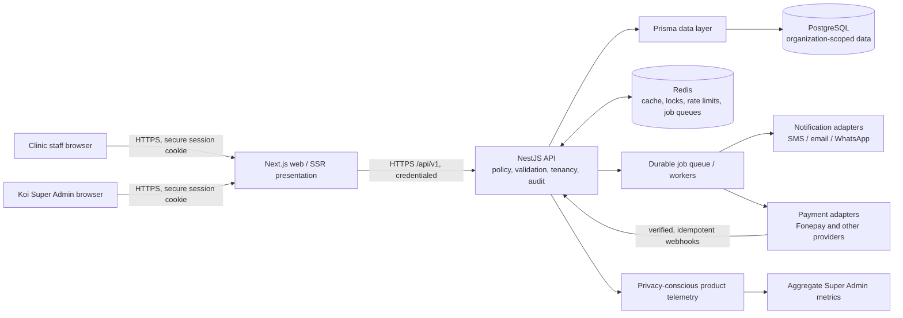

# Architecture Overview — ClinicFlow

| Field | Value |
| --- | --- |
| Status | Target architecture and ship-readiness baseline |
| Canonical product term | Client (`Customer` is legacy persistence terminology) |
| Canonical dates | Gregorian/AD, ISO-8601; BS is derived display data |

## 1. Architecture decision

ClinicFlow is a multi-tenant, API-first web application. **NestJS is the only business-rule and operational-data authority.** Next.js is the authenticated staff UI and SSR/BFF presentation layer only. It must call the versioned Nest API; it must not import Prisma, connect to PostgreSQL, or implement operational write rules.

This boundary applies to every clinic-owned domain: clients, records, appointments, scheduling, billing, payments, inventory, staff, configuration, reporting, and audit events. It also applies to future client-facing channels: those channels are explicitly out of this release, but will consume the same API boundary.

## 2. Production target



### Responsibilities

| Component | Required responsibility | Must not do |
| --- | --- | --- |
| Next.js | UI, SSR presentation, accessibility, request orchestration, rendering AD dates and optional BS equivalents | Direct Prisma/PostgreSQL access; domain authorization or persistence fallback |
| NestJS API (`/api/v1`) | Authentication, role/location authorization, tenancy filtering, validation, scheduling/finance/inventory rules, transactions, audit events, provider webhook verification | Trust caller-supplied organization, role, payment status, or calendar conversion as authoritative |
| PostgreSQL + Prisma | Durable relational source of truth and migration-managed schema | Be reachable from browser, Next operational code, or adapters directly |
| Redis | Shared cache, distributed scheduling/idempotency locks, rate limits, queue backing where selected | Become a financial or clinical source of truth |
| Workers/adapters | Retryable notification delivery, payment initiation/reconciliation, outbox delivery, telemetry aggregation | Mutate core records except through an authenticated/internal API command with idempotency and audit context |

## 3. API, tenancy, and security contract

- Production routes are versioned under `/api/v1`; legacy `/api` endpoints are migrated, then retired on a communicated schedule.
- The authenticated principal is resolved on every sensitive request by the Nest API. Organization and location scope are derived from membership/role assignment, never from a request body or browser storage.
- Production browser authentication uses short-lived secure, `HttpOnly`, `SameSite` cookies. Cross-site protections include CSRF defenses appropriate to the chosen cookie flow, TLS-only transport, session rotation, revocation, and server-side authorization checks. The UI cannot read the credential.
- Roles are additive: a user may hold multiple organization-wide or location-scoped roles. Owner and Admin include all clinic-level roles. The authorization specification is the action-level authority.
- Every organization-owned query and mutation includes an organization constraint. Location scope is additionally applied where a role is location-limited.
- Correlation IDs, structured logs, audit events, metrics, error reporting, rate limits, input validation, secret management, backups/restore testing, and health/readiness checks are production requirements.

## 4. Domain boundaries

**Identity and access** owns sessions, users, multi-role memberships, location scope, Super Admin controls, and support-access grants.

**Clinic operations** owns organizations, locations, clients, records, providers, services, appointments, provider availability, follow-ups, and communications. Provider availability—not chair/resource availability—is the release scheduling constraint. Resource/chair capability remains an extension boundary, not a release dependency.

**Finance and inventory** owns invoices, immutable completed-payment ledger entries, correction records, reconciliation, payment intents, provider adapters, stock balances, and immutable stock movements. Payment-provider credentials and webhooks belong to the adapter boundary; no provider-specific semantics leak into invoices or ledger rules.

**Platform administration** owns organization provisioning, de-identified aggregate telemetry, feature adoption, platform health, and audited support access. A Super Admin sees aggregates by default, not clinic-client or clinical content. A support-data access grant is reason-required, time-bound, least-privilege, read-only by default, audited, and clinic-notified where practical.

## 5. Current implementation evidence

The repository already contains a Next.js application (`apps/web`), Nest application (`apps/api`), Prisma PostgreSQL schema (`prisma/schema.prisma`), and API modules for appointments, clients (currently named `customers`), scheduling, billing, staff, providers, communications, and follow-ups. Nest has validation pipes and an `/api` global prefix. The existing schema contains organization identifiers, financial/audit models, and a `SuperAdmin` enum value.

The present application is **not yet the production target**:

- Next imports Prisma directly in `apps/web/lib/auth.ts`, `apps/web/lib/database-data.ts`, and several Next API routes, so it can read/write operational data outside Nest.
- Next login and `me` routes run their own Prisma-backed token logic; the web client persists a bearer token under `workflow-session-token` in browser `localStorage` and sends an `Authorization` header.
- The Nest controllers manually accept optional `authorization` headers; several endpoints have no framework-level authentication guard. `system/status` and `operational-data` are unauthenticated, and the repository must be audited endpoint-by-endpoint before release.
- The schema currently has a single `User.role`, `Customer`/`patientCode` naming, a unique client phone number, resource/chair fields, and `Organization.primaryCalendar` defaulting to `BS`. These conflict with the approved multi-role, client-first, provider-only, AD-canonical target.
- `ScheduleCacheService` is an in-memory `Map`, documented as a future Redis replacement. It is not safe for multi-instance cache coherence, locks, or queues.
- Payment and notification records exist, but no payment-provider adapter, webhook-verification/idempotency/reconciliation flow, durable worker, or inventory module exists.
- The repository has no project deployment manifest/container/orchestration configuration. It also needs CI/CD, secret provisioning, migrations-at-release, backups, monitoring, alerting, and disaster-recovery evidence.

## 6. Ship blockers and acceptance criteria

The production release is blocked until all of the following are true:

1. Remove every Next direct Prisma/operational route and require Nest `/api/v1` for operational reads and writes.
2. Deliver server-enforced, multi-role and location-scoped authorization; protect every non-public route and add tenancy tests for reads, writes, exports, and error paths.
3. Replace localStorage bearer credentials with the approved secure cookie/session design; implement CSRF, session expiry/revocation, login abuse protections, and security tests.
4. Make AD/ISO canonical in schema/API and use one shared BS conversion service strictly for display; migrate existing date/calendar settings safely.
5. Replace in-memory cache with shared Redis and use durable, idempotent worker/outbox patterns for notifications and payment processing.
6. Build the finance/inventory models and governed financial corrections described in the PRD. Fonepay readiness requires an adapter contract, signature verification, idempotency, sandbox tests, reconciliation, failure handling, and support runbook before enablement.
7. Implement provider-only scheduling conflict safety with a database-safe concurrency strategy and observability; resource/chair conflict logic is not a release requirement.
8. Establish deployable environments, TLS, secret rotation, migration/rollback and backup/restore procedures, performance/load/security testing, monitoring/alerts, and release sign-off.

## 7. Forbidden production flows

```text
Browser ──► PostgreSQL / Prisma                         FORBIDDEN
Next.js ──► Prisma / PostgreSQL for operational data    FORBIDDEN
Payment provider webhook ──► database directly          FORBIDDEN
Worker/adapter ──► unaudited core-record mutation        FORBIDDEN
Request body/header ──► trusted tenant or role selection FORBIDDEN
Super Admin ──► unrestricted clinic/client data          FORBIDDEN
BS display date ──► persisted canonical event timestamp  FORBIDDEN
```

## 8. Migration direction

Use additive, reversible migrations: introduce memberships/roles and location scopes; backfill the current single role; introduce client identifiers while retiring unique-phone enforcement; create AD defaults; migrate callers to `/api/v1`; then delete legacy Next data paths after telemetry proves no use. Each migration has data validation, rollback/forward-repair instructions, audit coverage, and staged rollout checks.
