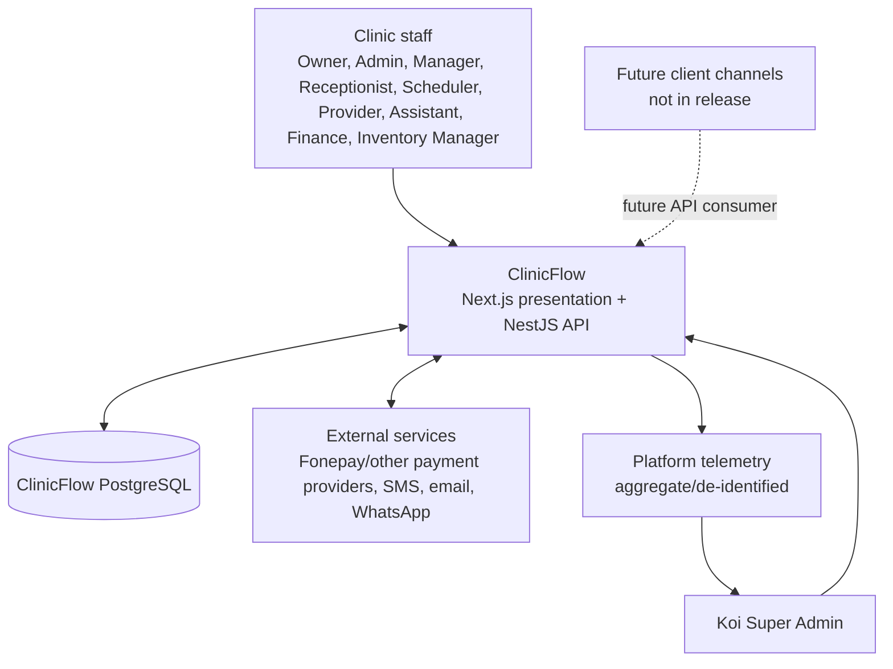

# System Context and Data Flow — ClinicFlow

| Field | Value |
| --- | --- |
| Status | Production target plus current-state gap register |
| Boundary owner | NestJS API is the sole business/data authority |
| Data language | Client and Record; legacy technical names may remain only during migration |

## 1. Context

ClinicFlow serves staff of tenant clinics and Koi platform operators. It is staff-facing for this release: there is no client portal, public booking, or client mobile application. The future client channel is intentionally isolated behind the same API and identity boundaries.



## 2. Trust zones and data classification

| Zone | Actors/data | Rule |
| --- | --- | --- |
| Public edge | Browser and payment-provider callback ingress | TLS, rate limits, request-size limits, validation, no direct database connectivity |
| Clinic application | Authenticated staff actions and tenant-scoped operational data | Nest resolves identity, roles, organization, and location scope for every action |
| Platform administration | Organization provisioning, operational telemetry, support grants | Super Admin aggregate metrics by default; sensitive support access is exceptional and audited |
| Data services | PostgreSQL, Redis, durable queue, secrets | Private network/service identity only; encrypted backups; least privilege |
| Third parties | Payment and notification providers | Adapter-specific credentials, verified webhooks, idempotency, retries, reconciliation, and no client-note leakage |

Client identity/contact and clinical Record data are sensitive. Financial records are integrity-critical. Analytics events must contain the minimum information needed for aggregate product success metrics; clinical note content and full client profiles are excluded.

## 3. Primary flows

### 3.1 Authenticated clinic request

```text
1. Staff browser sends HTTPS request with secure HttpOnly session cookie.
2. Next.js renders UI/SSR and sends a credentialed request to Nest /api/v1.
3. Nest validates session, resolves multi-role membership and location scope server-side.
4. Nest validates the command/query, adds organization/location predicates, and applies policy.
5. Nest runs the domain transaction through Prisma/PostgreSQL.
6. Nest writes audit/outbox events atomically with consequential changes.
7. Nest returns a tenant-scoped response; Next renders it.
```

No browser, Next route, SSR function, or client component can bypass steps 3–6 by importing Prisma or choosing an organization ID/role itself.

### 3.2 Provider-based booking and reschedule

```mermaid
sequenceDiagram
  participant U as Authorized staff
  participant W as Next.js UI
  participant A as Nest scheduling API
  participant R as Redis lock/cache
  participant P as PostgreSQL
  U->>W: Select client, provider, services, AD date/time
  W->>A: Create or reschedule command (idempotency key)
  A->>A: Resolve tenant/role/location and convert/validate dates
  A->>R: Acquire provider/time concurrency lock
  A->>P: Transaction: re-check provider availability, blocks, conflicts
  P-->>A: Commit appointment + audit/workflow/outbox events
  A->>R: Invalidate schedule cache; release lock
  A-->>W: Confirmed appointment or conflict response
  W-->>U: Show AD canonical time and optional BS equivalent
```

The release conflict key is provider availability. An appointment may carry a location, but chair/resource assignment and chair conflict enforcement are deferred. A reschedule preserves the original appointment as `Rescheduled` and creates a linked successor; it never overwrites history. All persisted instants and scheduling calculations use AD/ISO and `Asia/Kathmandu` local business rules; BS is produced by a tested conversion service only for display/API presentation.

### 3.3 Invoice and payment

```text
Authorized actor → Nest finance command → transaction
  invoice/ledger validation + role policy
  → immutable completed payment or a linked correction record
  → invoice balance/status recalculation
  → audit + durable outbox event

External flow: Nest creates provider-neutral payment intent → adapter initiates Fonepay/other provider flow
  → provider posts verified webhook → Nest validates signature, provider identity, amount, state and idempotency key
  → transaction records reconciliation result and only then completes the payment
```

A Receptionist may record a permitted payment against an issued invoice, but cannot edit/delete a completed payment, refund, void, reverse, reconcile, or configure providers. Finance initiates governed corrections; Owner/Admin approval applies above a configurable threshold. Provider callbacks do not directly mutate PostgreSQL, and completed payments are never silently overwritten.

### 3.4 Notifications and integrations

1. The core transaction writes a durable outbox event rather than sending SMS/email/WhatsApp inline.
2. A worker claims the event idempotently, invokes the configured adapter, records attempts/statuses, and retries safely.
3. Adapter failures and reconciliation exceptions become observable work/alerts without corrupting the appointment or finance record.

### 3.5 Super Admin metrics and support

```text
ClinicFlow event → privacy filter/aggregation → platform metrics store → Super Admin dashboard

Exceptional support: Super Admin → reason + scope + expiry request → audited grant
  → read-only, minimum required clinic data → expiration/revocation → audit review / clinic notification where practical
```

Metrics include organizations onboarded/active, active users, locations, onboarding progression, feature adoption, request/error health, and aggregate operational trends. They do not use Record text or detailed client data. Support access is not a standing cross-tenant privilege.

## 4. Current-state deviations / ship blockers

The following are repository facts, not approved production behaviour:

| Area | Current evidence | Required resolution |
| --- | --- | --- |
| Authority boundary | Web code imports `@prisma/client` through `apps/web/lib/prisma.ts`; `auth.ts`, `database-data.ts`, and Next API routes perform direct reads/writes | Remove/migrate all operational web Prisma paths to Nest `/api/v1` |
| Browser auth | `apps/web/lib/api-client.ts` defines `workflow-session-token`; current client flow uses bearer `Authorization` | Implement secure HttpOnly, SameSite session cookies plus CSRF/session lifecycle controls |
| Endpoint protection | Nest controllers accept optional authorization headers; `system/status` and `operational-data` have no framework guard | Establish default-deny guards and audit every route; only explicitly documented health endpoints can be public |
| Tenancy/roles | Schema has one `User.role`; current controllers/services use legacy patterns | Add multi-role memberships and location scopes; test isolation exhaustively |
| Dates/terminology | Schema defaults `Organization.primaryCalendar` to `BS`; `Customer`, `patientCode`, and clinical `Patient*` models remain | Make AD/ISO default and canonical; use Client/Record in UI/API/docs and migrate legacy names deliberately |
| Scheduling | Existing service still accepts resource IDs and schedule cache is process-local `Map` | Release provider-only collision rules with DB-safe concurrency, Redis locks/cache, and tests |
| Payments/inventory | Billing records exist but provider adapters, verified webhooks, ledger corrections/reconciliation, workers, and inventory are absent | Implement and operationally prove the required modules before enabling production payments/inventory |
| Operations | No project deployment/container/orchestration manifest is present in the repository | Define production environment, CI/CD, migrations, private networking, observability, backups/restores, alerts, and release runbooks |

## 5. Explicitly forbidden flows

```text
Next.js UI/SSR ─────────────► Prisma/PostgreSQL operational query or mutation
Browser/localStorage token ─► authorization decision or tenant selection
Payment webhook ────────────► direct database state change
Unauthenticated caller ─────► tenant operational endpoint
Super Admin ────────────────► routine client/Record browsing across clinics
BS date display ────────────► canonical stored timestamp/date
```

## 6. Evidence needed to mark the flows ready to ship

- End-to-end tests prove default-deny authentication, multi-role union, organization/location isolation, and audited support grant expiration.
- Concurrency tests prove two simultaneous requests cannot create a conflicting provider booking.
- Finance tests prove idempotent webhook handling, duplicate callback safety, partial payment calculation, correction workflow, and reconciliation recovery.
- Integration tests cover notification retries/outbox durability and payment-provider sandbox contracts (including Fonepay before it is enabled).
- Security, load, backup-restore, migration, monitoring/alert, and deployment rehearsal evidence is attached to the release record.
