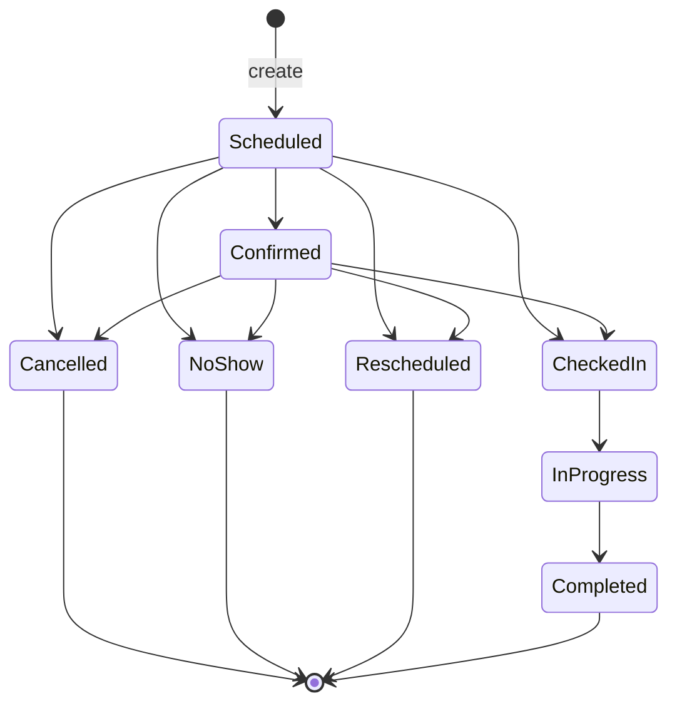
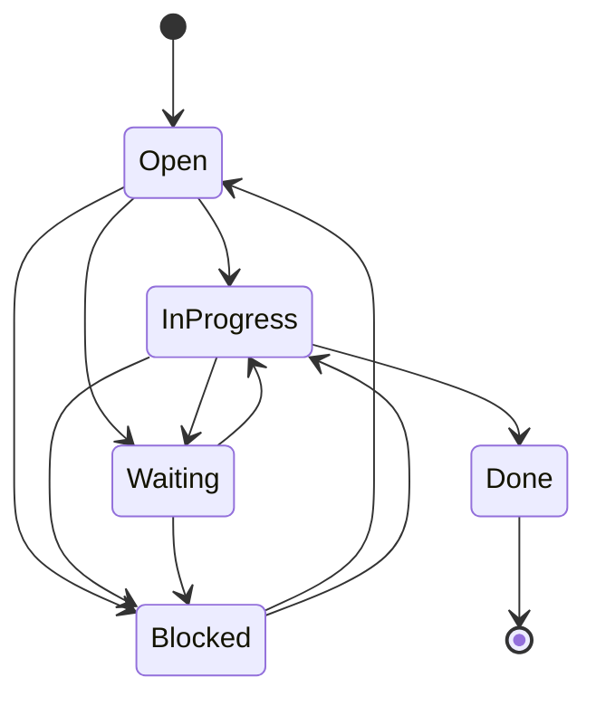
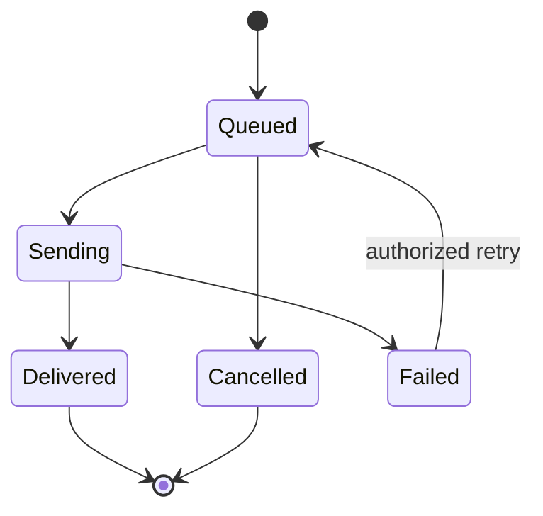
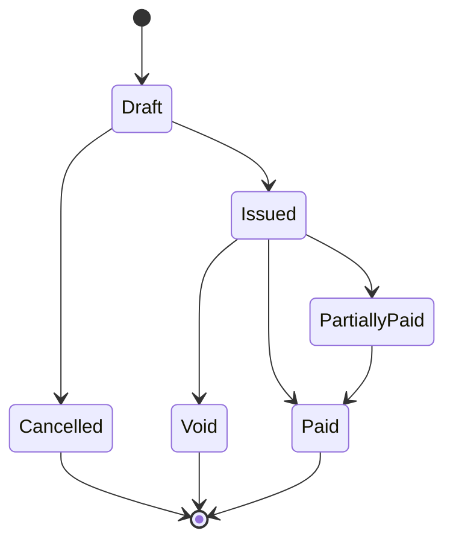
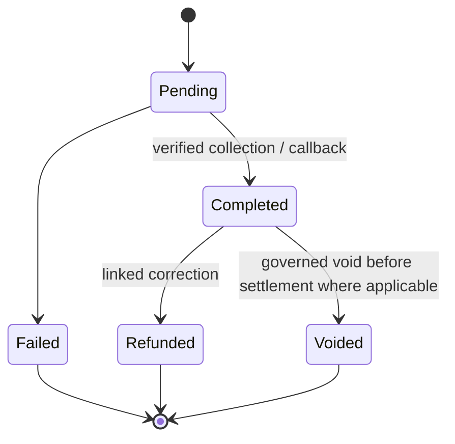
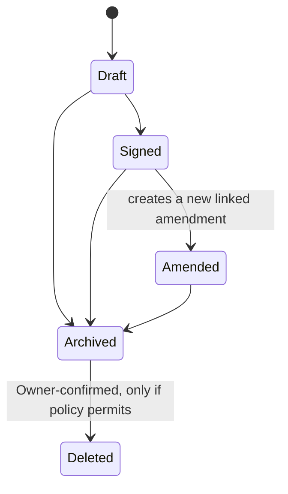

# Workflow and State Machine Catalog — ClinicFlow

| Field | Value |
| --- | --- |
| Status | Normative production target |
| Last updated | 2026-07-18 |
| Applies to | NestJS commands, workers, provider adapters, audit events, and user interfaces |
| Related specifications | [PRD](01-product-requirements-document.md), [Authorization](05-authorization-and-permission-matrix.md), [Scheduling](06-scheduling-rules-specification.md) |

## 1. Purpose and universal rules

This catalog is the authoritative lifecycle contract for ClinicFlow. A state transition is a server-side command, never an arbitrary update of a `status` field. NestJS must authorize the actor, validate the current state and record scope, persist the state/event/audit record atomically, and publish a durable outbox event in the same transaction when downstream work is needed.

- Product language is **client**. Legacy `Customer`, `AppointmentSession`, and `PatientDentalChart` persistence names do not change the product vocabulary.
- All timestamps and deadline calculations use canonical Gregorian/AD ISO-8601 values and the organization/location IANA timezone. A displayed BS date is derived only.
- Organization and location scope, feature configuration, and role permissions in the Authorization Matrix are prerequisites to every transition.
- Every consequential transition records actor or service identity, organization, location where applicable, prior and next state, reason when required, correlation ID, occurred-at time, and safe event metadata. Audit history is append-only.
- Critical records use two stages for deletion: **archive first**, then an **Owner-confirmed deletion from archive**. Deletion is denied while legal hold, retention, dependencies, or financial/clinical preservation rules apply. Normal workflow uses archival, not destructive deletion.
- A command may carry a caller-generated idempotency key. The API persists command result keyed by actor/service, organization, action, and key, and returns the original outcome to a retry. External callbacks additionally use the provider event ID and verified payload digest.
- Events are at-least-once delivered. Consumers must be idempotent using event ID/version and must not infer correctness from cache state or a user-interface display.

## 2. Command and event protocol

| Element | Requirement |
| --- | --- |
| Command | Named intent such as `appointment.check_in`, not a generic `PATCH status`. Includes expected record version for interactive changes where applicable. |
| Transaction | Writes the domain record, workflow event, audit event, and outbox row in one PostgreSQL transaction. A failed transition writes none of them. |
| Conflict | A stale version, invalid source state, lost authorization, provider conflict, or duplicate external callback returns a stable domain error. It never silently chooses a different result. |
| Outbox | Durable event with immutable ID, aggregate ID/type/version, event type, organization ID, payload reference/minimized payload, attempt state, and correlation ID. Worker delivery updates delivery state only. |
| Side effects | Notifications, analytics, cache invalidation, provider calls, follow-up creation, and read-model refresh consume the outbox. They cannot make a core transition succeed retroactively. |
| Retries | Use bounded exponential retry, a visible failed/dead-letter state, and an authorized replay command. Retries preserve idempotency key and do not duplicate client messages or payments. |

All APIs must return the resulting aggregate version and workflow event ID after a successful transition. Interfaces must refresh affected read models after acknowledgement; stale views cannot authorize a follow-on change.

## 3. Appointment lifecycle

Appointments reserve **provider** capacity only. Chairs/resources are not a first-release scheduling constraint. The reservation interval and database-backed concurrency requirements are defined in the Scheduling Rules Specification.

| From | Command → To | Authorized actors | Required checks / data | Event and side effects |
| --- | --- | --- | --- | --- |
| — | `appointment.create` → Scheduled | Owner/Admin, Manager, Receptionist, Scheduler; Provider for own work where enabled | Client, in-scope location/provider/services, AD time, provider-service eligibility; transactionally no provider overlap; horizon, availability, buffers and blocks valid | `appointment.created`; audit; schedule cache invalidation; optional reminder workflow |
| Scheduled | `appointment.confirm` → Confirmed | Authorized scheduling staff; Provider for own appointment | Appointment still future and capacity-reserving | `appointment.confirmed`; audit; communication/outbox as configured |
| Scheduled or Confirmed | `appointment.check_in` → CheckedIn | Owner/Admin, Manager, Receptionist, Scheduler; Provider/Assistant only for assigned work | Client present or authorized workflow evidence; appointment has not been cancelled/rescheduled | `appointment.checked_in`; audit; operational queue refresh |
| CheckedIn | `appointment.start` → InProgress | Assigned Provider; permitted Assistant support command; Owner/Admin exceptional workflow | Assigned clinical work and valid location scope | `appointment.started`; audit |
| InProgress | `appointment.complete` → Completed | Assigned Provider; Owner/Admin only through audited exceptional access | Completion outcome; any required Record workflow completed or explicitly deferred under clinic policy; follow-up decision recorded | `appointment.completed`; audit; create/update follow-up task as needed; finance/read-model events |
| Scheduled or Confirmed | `appointment.cancel` → Cancelled | Owner/Admin, Manager, Receptionist, Scheduler; Provider for own appointment | Mandatory standardized cancellation reason; before check-in | `appointment.cancelled`; audit; capacity released; cancel eligible unsent reminders; optional recovery task |
| Scheduled or Confirmed | `appointment.mark_no_show` → NoShow | Owner/Admin, Manager, Receptionist, Scheduler; Provider for own appointment | Scheduled end plus buffer elapsed, unless Owner/Admin override includes reason | `appointment.no_show`; audit; capacity released; idempotently create/update NoShowRecovery task |
| Scheduled or Confirmed | `appointment.reschedule` → Rescheduled plus new Scheduled successor | Owner/Admin, Manager, Receptionist, Scheduler; Provider for own appointment | Mandatory reason; successor passes complete commit-time scheduling validation; billing linkage reviewed | `appointment.rescheduled` and `appointment.created`; original/successor link; audit both; invalidate both schedule ranges |

`FollowUpRequired` is a legacy enum value and is forbidden as an open appointment state in the target model. Follow-up is an outcome plus a linked task. Completed, Cancelled, NoShow, and Rescheduled are terminal; correction is a new governed record or amendment, not reopening or deleting the appointment. A recurring series creates individual persisted appointments; each child transitions independently.

## 4. Follow-up lifecycle

| From | Command → To | Actors | Requirements and emitted events |
| --- | --- | --- | --- |
| — | `followup.create` → Open | Authorized operations/clinical actor, or system consumer | Type, client, owner/queue, due date, summary and next action required. `followup.created` is idempotent on source event/type/client/open-task key. |
| Open | `followup.start` → InProgress | Assigned owner; Manager/authorized operational staff | Assignment/scope valid. Emit `followup.started`. |
| Open or InProgress | `followup.wait` → Waiting | Assigned owner; Manager | Required reason and next review date. Emit `followup.waiting`. |
| Open, InProgress, or Waiting | `followup.block` → Blocked | Assigned owner; Manager | Required blocker reason and escalation/next action. Emit `followup.blocked`. |
| Waiting | `followup.resume` → InProgress | Assigned owner; Manager | Waiting reason resolved. Emit `followup.resumed`. |
| Blocked | `followup.reopen` → Open or InProgress | Manager/authorized owner | Blocker resolution required. Emit `followup.reopened`. |
| InProgress | `followup.complete` → Done | Assigned owner; Manager | Completion note/outcome required. Emit `followup.completed`; cancel only eligible queued reminders. |

Done is terminal. A new need creates a new task linked to prior task/source; it does not overwrite the completed task. Due-date changes, reassignment, and priority changes are audited commands that preserve status.

## 5. Notification and communication lifecycle

The first phase supports **WhatsApp and SMS** through provider adapters, not a direct provider call from the browser. Global feature flags are owned by Super Admin; each enabled feature also requires clinic-level enablement, valid provider configuration, approved message template, recipient consent/contact eligibility, and delivery monitoring. A disabled global flag blocks creation and delivery, except a Super Admin-approved safety shutdown/audit workflow.

| From | Command / event → To | Actor | Required rule and output |
| --- | --- | --- | --- |
| — | `notification.enqueue` → Queued | Authorized API/system consumer | Feature gates, clinic configuration, consent, template, recipient, schedule and idempotency key validated. Emit `notification.queued`. |
| Queued | worker `notification.dispatch` → Sending | Notification worker service identity | Claims one eligible row with lock/lease; renders approved template; adapter call is idempotent. Emit attempt audit/event. |
| Sending | verified provider delivery update → Delivered | Verified adapter/webhook service | Provider signature, event ID, recipient correlation and legal transition verified. Emit `notification.delivered`. |
| Sending | terminal adapter failure → Failed | Worker service | Store safe error classification, never provider secret/message content. Emit `notification.failed`; retry only under policy. |
| Failed | `notification.retry` → Queued | Authorized operations actor or controlled retry worker | Retriable failure; retain original/child attempt linkage; no duplicate message after an uncertain provider acknowledgement. Emit `notification.requeued`. |
| Queued | `notification.cancel` → Cancelled | Authorized scheduler/operations actor or system cancellation rule | Must not be sending/delivered; preserve reason. Emit `notification.cancelled`. |

Communication logs record manual/automated communication separately from notification delivery. A log may record confirmation but must not mutate appointment state without an explicit authorized appointment command. WhatsApp/SMS provider adapters must accept normalized intents, return provider references, isolate secrets, verify callbacks, and expose reconciliation/failure metrics. Super Admin may turn a channel or template family on/off globally, but may not use the setting to obtain clinic content.

## 6. Invoice lifecycle

All money is NPR by default with two-decimal precision. Tax and discount policy is organization-configured. Finance and inventory remain separate domains: inventory movement never changes invoice, payment, revenue, or accounting state automatically.

| From | Command → To | Actors | Requirements / emitted events |
| --- | --- | --- | --- |
| — | `invoice.create` → Draft | Finance; Receptionist draft-only; Owner/Admin; enabled Provider billing workflow | Client, organization/location, lines and monetary inputs validated. Emit `invoice.drafted`. |
| Draft | `invoice.update` → Draft | Draft authority | Recalculate totals server-side; retain audit before/after. Emit `invoice.updated`. |
| Draft | `invoice.issue` → Issued | Finance; Owner/Admin | Valid lines, currency/tax/discount, number, recipient and due-date policy. Freeze financial snapshot/line semantics. Emit `invoice.issued`. |
| Issued | completed payment causes → PartiallyPaid | Payment command/service | Completed paid amount is positive but below total. Emit `invoice.partially_paid`. |
| Issued or PartiallyPaid | completed payment causes → Paid | Payment command/service | Completed paid amount equals total within allowed rounding. Emit `invoice.paid`. |
| Draft | `invoice.cancel` → Cancelled | Finance; Owner/Admin | No collection; mandatory reason. Emit `invoice.cancelled`. |
| Issued | `invoice.void` → Void | Finance; Owner/Admin subject to finance policy | Mandatory reason and no completed collection. An invoice with any collection must use linked payment correction/reversal rules; it cannot be voided as a shortcut. Emit `invoice.voided`. |

Invoice status is derived transactionally from immutable completed payment ledger entries except explicit Cancelled/Void decisions. An issued invoice's financial snapshot cannot be edited in place. A correction is a credit/adjustment/replacement workflow with linked audit history; its detailed implementation belongs to the Billing and Payment Lifecycle specification.

## 7. Payment lifecycle and external-provider reconciliation

| From | Command/event → To | Actors | Requirements / emitted events |
| --- | --- | --- | --- |
| — | `payment.record` → Completed (manual) | Receptionist, Finance, Owner/Admin | Issued invoice, amount/method/reference/received time required; no overcollection unless approved policy. Transactionally record immutable ledger row and recalculate invoice. Emit `payment.completed`. |
| — | `payment.initiate` → Pending | Finance; Owner/Admin; authorized provider flow | Feature/provider enabled, payment intent/reference/idempotency key and invoice correlation recorded. Emit `payment.pending`; adapter call via outbox. |
| Pending | verified provider settlement/callback → Completed | Verified payment adapter service | Signature, provider event ID, amount/currency/reference, invoice and expected state validated; duplicate events return prior result. Emit `payment.completed`; recalculate invoice transactionally. |
| Pending | verified terminal failure → Failed | Adapter service | Record safe failure code/details; emit `payment.failed`; no invoice balance change. |
| Completed | `payment.refund` → Refunded | Finance initiates; Owner/Admin approval at configured threshold by a different person | New linked correction/ledger record, reason, provider/cash handling and reconciliation requirements. Never modify or delete original payment. Emit `payment.refunded`. |
| Completed | `payment.void` → Voided | Finance/Owner/Admin only where settlement rules permit | Reason, approval rules and provider confirmation required. Create linked correction rather than alter original transaction history. Emit `payment.voided`. |

Completed payment entries are append-only. Receptionists may record a payment but cannot issue/void invoices, edit/delete completed payments, refund, reverse, reconcile, or configure providers. Fonepay and other Nepal providers use the same adapter contract: sandbox validation, live credentials, signed webhook verification, callback idempotency, reconciliation, and a per-clinic enablement gate are release requirements before live use.

## 8. Clinical Record lifecycle

`Record` is the canonical product term for visit outcome, clinical notes, and chart revisions. The release does not position this as a complete EHR. Providers may read all in-scope client records initially, but clinical write/sign authority is limited to assigned work; Assistants can create permitted drafts only.

| From | Command → To | Actors | Requirements / emitted events |
| --- | --- | --- | --- |
| — | `record.create_draft` → Draft | Assigned Provider; permitted Assistant | Linked assigned appointment/work; client and content scope valid. Emit `record.drafted`. |
| Draft | `record.update_draft` → Draft | Draft author or assigned Provider | Version check; audit change. Emit `record.updated`. |
| Draft | `record.sign` → Signed | Assigned Provider; Owner/Admin only through audited exceptional access | Provider attestation and required fields. Signed content becomes immutable. Emit `record.signed`. |
| Signed | `record.amend` → Amended (new linked record/revision) | Clinically authorized Provider; exceptional access policy | Original remains immutable; amendment reason, author, time, and predecessor link required. Emit `record.amended`. |
| Draft, Signed, or Amended | `record.archive` → Archived | Owner/Admin according to governance policy | Reason, retention/legal-hold validation and audit. Archive removes ordinary workflow visibility but preserves required history. Emit `record.archived`. |
| Archived | `record.delete_confirmed` → Deleted | Owner only | Explicit confirmation/re-authentication; retention/legal-hold/dependency checks; deletion authorization and immutable deletion audit. Default is deny where clinical retention requires preservation. Emit `record.deleted`. |

Dental-chart revisions are immutable versioned Record artifacts. A signed record or chart revision is never overwritten or removed by an ordinary update/delete endpoint. Where regulatory or retention policy forbids destruction, the Owner-confirmed deletion command remains unavailable and the archived record is retained.

## 9. Cross-cutting acceptance and current deltas

The release is accepted only when every table above is implemented in NestJS command handlers, protected by authorization/tenant tests, produces workflow/audit/outbox records atomically, and has automated transition and retry tests. Required tests include invalid state edges, stale-version rejection, duplicate commands, duplicate provider callbacks, worker retries, authorization loss, cross-tenant attempts, timezone boundaries, financial arithmetic, and Super Admin disabled-feature behavior.

Current repository enums and endpoints are a baseline, not proof of compliance. Known gaps include generic arbitrary appointment status updates, a follow-up endpoint that directly sets `Done`, mutable/deletable payment behavior, no durable outbox/worker or provider adapter, no global Super Admin feature flags, no governed Record signing/amendment lifecycle, and legacy resource/chair fields. These gaps block release until the target workflows replace or safely migrate the existing behavior.
