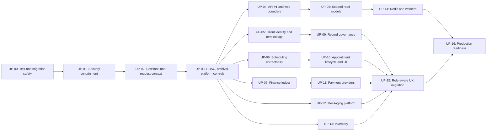

# Comprehensive Upgrade Plan — ClinicFlow

| Field | Value |
| --- | --- |
| Status | Approved-target implementation plan |
| Source of truth | Documents 01–18 and the 2026-07-18 code audit |
| Implementation mode | One completed work package at a time; no release shortcuts around security, scheduling, clinical, or financial controls |
| Product boundary | Staff-facing, Nepal-first dental clinic management; client-facing applications and online booking remain out of scope for this release |

## 1. Goal

Move the existing Next.js + NestJS + Prisma application from an early functional baseline to the documented ClinicFlow release target: a secure, multi-tenant, API-first clinic system where NestJS is the sole data and business authority.

The target includes additive multi-role access, Super Admin platform controls, Client-first terminology, AD/ISO canonical dates with optional BS display, provider-only scheduling, governed Records, immutable finance workflows, separate inventory, WhatsApp/SMS delivery controls, and payment-provider readiness beginning with Fonepay.

This is deliberately a migration plan, not a big-bang rewrite. Existing `Customer`, `AppointmentSession`, and related legacy names remain persistence compatibility details until the relevant migration is complete; all new contracts and UI use the canonical terms **Client** and **Record**.

## 2. Audit baseline

The audited codebase already has useful foundations: a monorepo, Nest API, Next staff UI, Prisma/PostgreSQL schema, scheduling/provider models, billing models, calendar utilities, and audit/workflow tables. It is not safe or complete enough to ship against the approved specifications.

### Immediate release blockers

| Area | Confirmed gap | Required outcome |
| --- | --- | --- |
| Data boundary | Next.js directly uses Prisma, and Nest is not the sole authority. Some Next and Nest routes are unauthenticated. | All operational data uses authenticated Nest `/api/v1`; no web Prisma fallback. |
| Identity and tenancy | Browser-readable bearer token, scalar `User.role`, caller-supplied organization IDs, and inconsistent authorization. | HttpOnly cookie sessions, default-deny API guard, server-derived tenant/location scope, additive roles. |
| Critical-data governance | Direct delete paths and destructive cascade relations exist. | Archive first; Owner-only permanent deletion from archive with explicit confirmation, retention/legal-hold checks, and audit evidence. |
| Scheduling | No database commit-time overlap guard; resource/chair logic remains active; status updates are generic. | Provider-only scheduling, AD/IANA timezone rules, database-safe booking concurrency, named lifecycle commands. |
| Clinical data | Current Record/chart data can be mutated or deleted. | Draft/sign/amend governance and append-only revisions. |
| Finance | P4B manual ledger is implemented: location-scoped Finance roles, idempotent draft/issue/payment commands, immutable completed receipts, governed corrections/approval, and read-only reconciliation. Provider settlement is not implemented. | Complete disposable-PostgreSQL concurrency evidence, archive/retention and persisted reconciliation resolution; then add the provider-neutral/Fonepay sandbox adapter in P6B. |
| Platform functions | No inventory domain, background worker, Super Admin platform workspace, feature flags, or notification adapter controls. | Separate inventory, durable jobs/outbox, aggregate platform metrics, global integration kill switches. |
| Performance and data loading | Dashboard/Client bounded reads exist, but Schedule and several settings/operations routes still wait for the oversized `/operational-data` compatibility payload; client startup also contains avoidable request waterfalls. | Make P2R the active blocker: establish route budgets and telemetry, remove serial/duplicate reads, finish route-owned read models, add scoped caching/prefetch/optimistic rollback, and prove p50/p95 behavior under realistic clinic data. |
| Navigation and responsive UX | Shared shell/drawer foundations exist, but clinic review found repeated headings, sidebar actions leaving the viewport, weak mobile layouts, and an unusable Super Admin experience. | Fix reachability/permission regressions immediately, then complete the calendar, platform, and system-wide responsive redesign against stable workflows and the approved visual references. |
| Operations | No CI pipeline, deployable worker/Redis architecture, health/readiness, observability, or recovery evidence. | Tested delivery pipeline and production runbook evidence. |

## 3. Delivery rules

1. Work packages are completed in sequence unless the dependency graph explicitly permits a small parallel subtask.
2. Every package includes Prisma migration rehearsal, rollback/forward-repair notes, API and authorization tests, and updated documentation/ADR where the decision changes.
3. New public contracts are versioned under `/api/v1`. Legacy `/api` routes are compatibility-only, measured, and retired after migration.
4. No production route accepts `organizationId`, role, or location scope from a browser request as authority.
5. No UI-only permission check is accepted as security. Server denial tests are mandatory.
6. No direct mutation or deletion of signed Records, completed payments, stock movements, workflow events, or audit logs is introduced.
7. No payment, messaging, or cache adapter is allowed to become a source of truth; durable state remains in PostgreSQL through Nest commands.

## 4. Dependency map

## 5. Ordered work packages

### UP-00 — Test, migration, and delivery safety baseline

**Purpose:** Make later changes measurable and reversible before changing business behavior.

- Add Nest unit, integration, API, and end-to-end test harnesses using isolated PostgreSQL databases; keep fixtures synthetic.
- Add a two-organization fixture and baseline negative tests for cross-tenant reads/writes.
- Add migration rehearsal tooling and an expand/contract migration checklist. Never use `prisma db push` outside local development.
- Establish CI gates for formatting, typecheck, web/API build, migration validation, tests, dependency/secret scanning, and a static rule that forbids Prisma imports from Next operational code.
- Record baseline behavior tests for scheduling and billing only where needed to preserve intentional behavior during replacement.

**Done when:** CI runs all quality gates; an isolated test database is available; and a deliberately cross-tenant request fails in automated tests.

### UP-01 — Security containment and exposed-route closure

**Purpose:** Stop known unauthorized access before expanding functionality.

- Inventory every Nest controller and Next route; classify each as authenticated, explicitly public, internal worker, or provider webhook.
- Introduce a Nest global default-deny guard. Login, liveness, readiness, and verified provider webhook endpoints are the only explicitly public classes of routes.
- Immediately secure organization, follow-up, communications, system, and operational-data routes; remove trust in caller-supplied tenant IDs.
- Disable or migrate unauthenticated Next Prisma mutation routes. Do not silently fall back to seed data when data access fails.
- Add request correlation IDs, structured authorization-denial logs, explicit CORS allowlists, security headers, and rate limiting appropriate to login and public callback routes.

**Done when:** endpoint-inventory tests fail on an unclassified/protected route; no known public operational mutation remains; cross-tenant denial tests cover every existing module.

### UP-02 — Secure sessions and server request context

**Purpose:** Replace browser-readable bearer credentials with the documented session design.

- Create server-side session records with expiry, rotation, revocation, logout, device/session metadata, and audit events.
- Expose a clearly labelled **Sign out** action that remains reachable in the anchored desktop shell and the mobile/profile surface without relying on hover. One activation must enter a disabled pending state, revoke the active server session, clear all tenant-scoped in-memory caches and sensitive drafts, notify other tabs, and redirect to sign-in without briefly rendering clinic data. An expired/revoked session follows the same local cleanup and redirect path. Ordinary sign-out needs no confirmation unless an unsaved protected form would be discarded; sign-out-all-devices remains a separate explicit session-management action.
- Issue short-lived secure `HttpOnly`, `Secure`, `SameSite` cookies; add CSRF defenses for state-changing browser requests.
- Validate required production secrets at startup; remove fallback secrets and browser `localStorage` token persistence.
- Build a Nest request actor context that resolves active user, organization, effective roles, and permitted locations server-side.
- Migrate Next API client/auth screens to credentialed cookie transport and clean handling for expiry, revocation, and authorization errors.

**Done when:** tokens are not readable by application JavaScript; revoked/expired sessions fail immediately; authentication and tenant scope are established only in Nest.

### UP-03 — Additive RBAC, archival primitives, and platform control foundation

**Purpose:** Install the shared policy foundation required by every governed domain.

- Introduce organization membership, additive `RoleAssignment`, optional location scope, effective/revoked dates, and role-assignment audit history.
- Add `Finance` and `InventoryManager` roles. Owner/Admin receive all clinic capabilities; Super Admin remains platform-scoped and has no implicit clinic-data access.
- Backfill existing scalar roles using restrictive dual-read authorization, then retire `User.role` as the authority after verified migration.
- Implement a shared critical-data lifecycle: `Active → Archived → Owner-confirmed permanent deletion`, with confirmation challenge, legal hold/retention checks, tombstone audit, and safe relation policies replacing destructive cascades.
- Add Super Admin platform models: aggregate/de-identified usage events, feature flags, organization-level overrides, and time-bound reasoned support-access grants that default to read-only.
- Add server capability endpoints so the UI renders authorized actions without making authorization decisions itself.

**Done when:** a multi-role, location-scoped user has exactly the server-enforced union of assigned capabilities; only an Owner can finalize eligible archived deletion; Super Admin aggregate access and support grants are audited.

### UP-04 — API v1 contract and removal of the direct web data boundary

**Purpose:** Make Nest the only operational authority without a disruptive table rename.

- Establish `/api/v1`, a consistent `{ data, meta }` response envelope, standard problem errors, correlation IDs, cursor pagination, `Idempotency-Key`, and `ETag`/`If-Match` conventions.
- Implement authenticated, scoped v1 endpoints in domain slices; derive tenant/location from request context rather than body/query input.
- Replace direct Next Prisma reads/writes and Next operational API routes with Nest calls. SSR is presentation-only.
- Replace the unauthenticated oversized `operational-data` response with small, permission-filtered bootstrap, dashboard, schedule, Client, and billing read models.
- Remove production direct-Prisma/seed fallback paths and then retire legacy endpoints after telemetry confirms no callers.

**Done when:** a repository check proves Next operational code does not import Prisma; all staff screens operate via authenticated v1 API calls; no production route returns first-organization data or a cross-domain bulk dump.

### UP-05 — Client identity, merge governance, and terminology migration

**Purpose:** Adopt Client as the public canonical identity while preserving data safely.

- Add an atomic organization-scoped Client-code allocator and immutable opaque Client ID.
- Remove organization-unique phone enforcement; store normalized searchable contacts and duplicate-match signals while allowing shared family contacts.
- Replace the scalar phone as contact authority with auditable multi-phone Client contacts. Allow shared household numbers, append a new number when reception chooses an existing Client, and retain the scalar phone only as a temporary compatibility projection.
- Add a pending identity-review workflow for minimal booking intake, prior-visit claims, and skipped possible matches. These signals may suggest merge candidates but must never auto-merge records.
- Add Client aliases, duplicate-review/merge history, conflict resolution, authorized rollback/repair procedure, and archive-not-delete behavior for merge secondaries.
- Introduce `/clients` contracts and migrate screens/routes/copy from patient/customer/reservation to Client/Appointment. Keep narrowly scoped legacy aliases until all callers migrate.
- Ensure Clients may later receive portal identities/consent records without enabling client-facing apps now.

**Done when:** two Clients in one organization may share a phone; concurrently created Clients receive unique codes; a merge preserves history and archives rather than destroys the secondary Client.

**Implementation evidence (2026-07-27):** the standalone `/clients` intake now uses the same minimal fields and number-first match review as booking. Receptionists and Providers who receive a new caller can select an existing record and append a genuinely new number, or explicitly continue as a distinct Client. Provider authority is deliberately limited to governed creation and caller-phone append; general profile correction, archive, merge, deletion, and review resolution remain denied. New creation revalidates the exact candidate set inside one serializable transaction, allocates the code, creates Client/chart/primary phone/review/audit data, and writes a minimal idempotency receipt. Supabase-backed tests prove concurrent replay, different-key same-identity serialization, and complete rollback when receipt persistence fails. Receipt storage excludes contact, demographic, and clinical fields and cascades with an Owner-governed Client purge. Authenticated responsive QA remains open.

### UP-06 — Scheduling correctness core

**Purpose:** Make provider-based bookings correct under concurrent usage.

- Change canonical defaults to AD/ISO; retain BS only as a centralized derived display/input conversion. Migrate organization calendar defaults and seed/UI behavior from BS to AD.
- Replace the large custom picker interaction with one compact native-like date primitive: native AD input fallback, consistent styled popover behavior, keyboard/focus support, and optional derived BS context.
- Resolve scheduling with the location IANA timezone (Nepal default `Asia/Kathmandu`), honoring availability effective dates, one-time/recurring blocks, service/provider duration overrides, and buffers.
- Make provider capacity the only release constraint. Detach `Resource`/chair logic from booking validation, slot generation, and UI; retain it only as dormant future-extension data.
- Use Owner-controlled organization slot starts (allowed 5/10/15/20/30/60 minutes, default 15) and a 12-month booking horizon; keep cadence independent from service/appointment duration and remove legacy `FollowUpRequired` as an appointment capacity state.
- Commit create/update/reschedule through PostgreSQL transactions with a provider-time-range exclusion constraint or equivalent database lock-and-recheck guard.

**Done when:** simultaneous requests cannot double-book a provider; different providers do not conflict; cache absence cannot affect correctness; timezone/effective-date/buffer tests pass.

**Implementation evidence (2026-07-26):** guided Client-first and slot-first booking now converge on a durable idempotent confirmation receipt and one serializable PostgreSQL transaction. The transaction re-derives the effective Provider-window/service buffer, validates the exact hold, rejects stale Client candidate sets, creates Client/appointment/audit/workflow data together, and consumes the hold only on commit. Supabase-backed integration coverage proves concurrent same-key replay, same-slot exclusion, identity-phantom retry, expired-hold denial, and rollback after Client creation. Authenticated responsive/browser QA remains open.

### UP-07 — Finance ledger and invoice lifecycle

**Purpose:** Replace editable finance records with controlled financial commands.

- Migrate financial data to explicit NPR decimal/currency, location, snapshot, invoice-number allocation, archive, idempotency, correction, approval, and retention fields/models.
- Implement explicit draft-create/update, issue, void, cancellation/correction, record-payment, refund, reversal, and reconciliation commands. Remove generic finance `PATCH`/`DELETE` semantics.
- Freeze issued invoice client/line/tax/discount snapshots; calculate totals and balances atomically in transactions.
- Make completed payments append-only. Refunds, reversals, and voids are linked correction events, never edits/deletes.
- Enforce capability separation: Receptionist may create/edit draft invoices and record an eligible payment against an issued invoice; Finance/Owner/Admin manage issuance and corrections; high-value corrections require a distinct Owner/Admin approver.
- Provide finance ledger, aging, and reconciliation-exception read models.

**Done when:** parallel payment attempts cannot over-collect; issued snapshots cannot change; completed payments cannot be edited/deleted; the Receptionist permission boundary is proven by server-denial tests.

**Implementation evidence (2026-07-27):** `/api/v1/finance` owns location-scoped workspace/detail reads and idempotent draft-create, issue, payment, Refund/Reversal, approval/rejection, and reconciliation contracts using NPR decimal strings. Invoice, payment, correction, and audit writes share serializable transactions and deterministic replay hashes; completed receipts are never edited. The default correction threshold fails safe to distinct Owner/Admin approval, and self-approval is denied. The responsive Finance UI exposes New Invoice, Issue, Record Payment, immutable ledger, correction, approval, and daily reconciliation drawers without Inventory coupling. Legacy billing mutations are retired and remaining compatibility reads are location-scoped. Migrations `20260727_000019` and `20260727_000020` are applied to Supabase. A Supabase-backed gate proves concurrent partial payments cannot over-collect and concurrent correction requests cannot over-reserve the same receipt, with exact durable ledger/audit results. Authenticated visual QA remains open; Fonepay stays in P6B.

### UP-08 — Scoped operational read models

**Purpose:** Replace bootstrap coupling with small, auditable read surfaces.

- Deliver session bootstrap, dashboard, provider schedule, Client profile, billing workspace, finance reconciliation, Staff Management, and platform aggregate read models with field-level capability filtering.
- Give Staff Management a bounded, paginated `/api/v1` projection for summary counts, search, status, additive roles, location scope, provider linkage, invitation/session readiness, and permitted actions. Do not make the page wait for the clinic-wide operational aggregate or download sensitive fields that the acting user cannot use.
- Version read-model schemas and define stable cache/invalidation ownership, but keep PostgreSQL/Nest as the authority.
- Add loading, empty, unavailable, and permission-denied states. An API outage must never trigger direct database or seed-data fallback.

**Done when:** each workspace loads only its required, authorized data and has an explicit degraded state.

**Implementation evidence (2026-08-22):** Staff Management now owns a bounded, paginated `/api/v1/staff` projection with server search/filter/sort, role/location scope, summary counts, capability metadata, and demand-loaded Provider schedule detail. Settings owns `/api/v1/settings`, enforces organization-scoped Owner/Admin access, and limits slot-start interval control to the Owner. Every frontend workspace route now starts from either the minimal workspace shell projection or the bounded Schedule bootstrap; the legacy `/operational-data` aggregate has no frontend caller. Schedule reads are grouped under `/api/v1/schedule`; Day view uses one appointment-plus-grid snapshot, aborts superseded visible reads, and prefetches adjacent dates into a bounded session cache. Ordinary clinic-route transitions share the authenticated session/workspace bootstrap; logout, expiry, session end, mutation invalidation, and 401 clear the applicable caches. Authenticated viewport evidence and representative-volume latency/query-plan gates remain open.

### UP-09 — Record and dental-chart governance

**Purpose:** Protect clinical history without losing correction capability.

- Replace mutable `AppointmentSession` behavior with Record lifecycle commands: draft, sign, and append amendment.
- Enforce provider/assistant clinical permissions: Assistant may draft; authorized provider signs; signed content is immutable; corrections append a version/amendment with reason and audit trail.
- Store dental-chart revisions as append-only snapshots tied to actor and source Record; prohibit direct deletion of historical revisions.
- Apply client/record archive, legal hold, and Owner-confirm-delete rules without permitting routine destruction of clinical data.

**Done when:** a signed Record/chart cannot be overwritten or deleted; an amendment preserves prior content, actor, time, and reason; authorization tests cover Client-wide provider read access and assigned-work clinical write/sign controls.

### UP-10 — Appointment state machine and provider-first scheduling UX

**Purpose:** Turn correct scheduling data into controlled staff workflows.

- Replace generic appointment-status updates with named commands for confirm, check in, start, complete, cancel, no-show, and reschedule.
- Require cancellation reason; enforce no-show timing; make reschedule create a linked successor while terminally preserving the original appointment.
- Emit workflow/audit/outbox events atomically with every transition and create follow-up tasks as outcomes, not appointment states.
- Migrate booking/schedule UI to provider-first selection, capacity-safe conflict messages, AD default with optional BS display, and no chair/resource requirements.
- Make booking globally available from the authenticated shell and implement two guided paths—Client first and slot first—that share number-first Client matching, minimal New Client intake, possible-match review, a single confirmation payload, collapsed optional details, draft preservation, and server-confirmed submission.
- In slot-first booking, create a short hold only after a slot is selected; display the held slot throughout Client identification and convert it transactionally on confirmation.

**Done when:** invalid transitions fail server-side; rescheduling never rewrites history; UI supports provider-only booking at the same rules used by the API.

**Implementation evidence (2026-08-22):** named lifecycle commands, successor-based rescheduling, Provider-based availability, both guided paths, short slot holds, and one idempotent atomic confirmation contract are implemented. Confirmation remains server-authoritative. When a confirmation is still pending after 400 ms, the drawer minimizes into a persistent status surface so staff can continue using the workspace; the protected request stays mounted, success is shown only after the PostgreSQL commit response, and uncertain results reopen with the exact payload fingerprint/idempotency key for deterministic replay. Signed-in slow-network, accessibility, and responsive QA remain open.

### UP-11 — Payment-provider platform and Fonepay sandbox readiness

**Purpose:** Support Nepal payment providers without embedding provider semantics in finance records.

- Add provider accounts, payment intents, webhook events, reconciliation rows, encrypted clinic credential references, and idempotency/correlation storage.
- Define a provider-neutral adapter contract. Implement Fonepay as the first sandbox adapter with signed callback verification, replay-safe handling, status inquiry, refund capability discovery, and reconciliation.
- Run processing through durable outbox/worker jobs; a redirect is never proof of payment.
- Require global Super Admin feature flag, clinic configuration, Owner/Admin authorization, sandbox evidence, monitoring, and provider onboarding/certification before any clinic live enablement.

**Done when:** Fonepay sandbox signature/replay/failure/reconciliation tests pass; no duplicate callback can produce a second receipt; live provider enablement is impossible without both platform and clinic approval.

### UP-12 — WhatsApp/SMS notification platform

**Purpose:** Deliver phase-one communication safely through external providers.

- Separate manual communication history from appointment-state mutation.
- Add notification intents, templates, channel/provider configuration, attempts, delivery receipts, retry policy, outbox jobs, consent/contact checks, cancellation, and audit events.
- Implement SMS and WhatsApp adapters behind a global Super Admin feature flag and separate clinic-level configuration/enablement. The global off switch halts new work and safely prevents delivery.
- Provide delivery status/failure monitoring and staff-facing, permission-aware communication views.

**Done when:** an unconfigured or globally disabled channel cannot send; notification retries are idempotent; provider failures do not alter appointments without an explicit workflow command.

### UP-13 — Separate inventory domain

**Purpose:** Ship inventory independently of finance and scheduling resources.

**Delivery status (2026-08-16):** the **R0I Inventory Operations** core is implemented and its migrations are applied. It includes the tangible catalog, audited reorder settings, location balances, receive/use/adjust/stocktake/transfer commands, lot/expiry handling, suppliers, archive/restore/eligible Owner-confirmed purge, alerts, and immutable history. Authenticated responsive and role/location workflow QA remains the acceptance gate before release certification. Procurement automation, automatic Record consumption, supplier lifecycle management, and accounting/COGS integration remain future work.

- Add inventory item, category, supplier, location balance, lot/expiry where needed, immutable stock movement, transfer, adjustment, stocktake, and reorder projection models.
- Enforce `InventoryManager`/Owner/Admin controls with location scope and archive-first lifecycle where eligible.
- Build inventory APIs and UI for receiving, consuming, transferring, counting, adjusting, expiry/reorder views, and auditable correction movements.
- Explicitly prevent automatic invoice, payment, COGS, or accounting entries from inventory actions.

**Done when:** every balance derives from immutable movements; cross-tenant/location movement is rejected; inventory actions cannot change finance records.

### UP-14 — Redis, worker, cache, and event delivery platform

**Purpose:** Scale read performance and integrations after correctness is established.

- Replace in-process schedule/cache maps with Redis-backed, tenant/scope/version-keyed cache adapters, TTLs, invalidation metrics, and bounded private browser caching.
- Add durable worker topology for outbox dispatch, messaging, payment reconciliation, and scheduled tasks.
- Make mutation events and cache invalidation idempotent and observable; cache failure must degrade to authoritative database/API reads.

**Done when:** multi-instance invalidation works; cache/queue health is measured; no cache or worker path can create financial/clinical/scheduling truth outside controlled Nest commands.

### UP-15 — Role-aware UX completion and accessibility

**Purpose:** Complete staff and platform workflows against stable, server-backed capabilities.

- Migrate navigation and actions from hard-coded role lists to server-provided capabilities.
- Complete Client, Record, scheduling, invoice/ledger/correction/reconciliation, inventory, messaging, staff-role, archive/delete, and Super Admin platform screens.
- Replace the compatibility Staff screen with a professional Staff Management workspace: concise page header and primary action; real summary counts; debounced search; role, location, and account-status filters; sortable/paginated desktop table; equivalent mobile cards; clear role/location/status chips; and accessible loading, empty, denied, unavailable, and retry states. Create, invite, edit, assign additive roles/location scope, link Provider identity, deactivate/archive, restore, and other permitted actions use the shared right-side drawer with dirty-state protection and server capability checks. Destructive or access-changing actions show their consequences, produce audit evidence, and never rely on a UI-only role decision.
- Add platform views for clinic onboarding, de-identified usage/adoption metrics, feature flag control, and audited support-access grants.
- Verify responsive layout, keyboard flow, focus/error handling, WCAG 2.2 AA, loading/empty/error states, idempotency/conflict feedback, and AD/BS labeling.
- After functional workflows stabilize, run a dedicated responsive/native-feel certification across 320–430px phones, 768/820px tablets in both orientations, 1024px compact desktop, 1280/1440px standard desktop, and 1920px large desktop. Include safe areas, virtual keyboards, touch/coarse-pointer use, 200% zoom, OS text scaling, reduced motion, keyboard-only navigation, native input purpose/autocomplete and slow-device behavior.

**Done when:** every visible sensitive action has a matching server permission test; core screens pass accessibility checks and explicit unavailable/error states; no production workflow has page-level overflow, clipped or unreachable actions, hover-only essentials, virtual-keyboard obstruction, or a desktop-shrunk mobile presentation.

### UP-16 — Production operations and release certification

**Purpose:** Prove the system is operable before clinic rollout.

- Provision distinct development, test, staging, and production environments with isolated PostgreSQL/Redis, secrets, provider credentials, and callback URLs.
- Build immutable web/API/worker artifacts; run controlled `prisma migrate deploy`; add health/live and health/ready probes, structured logs, error tracking, metrics, traces, and alerts.
- Establish backup encryption/retention, quarterly restore drills, migration rollback/forward-fix procedure, incident response, on-call ownership, and release/change records.
- Run load, security, tenancy, scheduling-concurrency, financial-integrity, provider-webhook, and disaster-recovery tests in staging.
- Complete a launch gate evidence pack mapped to documents 03–18.

**Done when:** staging rehearsal, restore drill, alert exercise, security assessment, integration certification, and launch sign-off all have recorded evidence.

## 6. Continuous acceptance matrix

These checks are added when their first relevant package begins and remain release gates thereafter.

| Invariant | First package |
| --- | --- |
| No cross-organization read, write, export, report, or error-data leak | UP-00 / UP-01 |
| Authentication/session revocation and CSRF protections | UP-02 |
| Additive role and location-scope permission union | UP-03 |
| Critical records archive before Owner-confirmed purge; retention blocks final deletion | UP-03 |
| No direct Next operational Prisma access | UP-04 |
| Shared Client phone, immutable unique Client code, governed merge | UP-05 |
| No provider double booking under concurrent requests | UP-06 |
| Server-only valid appointment transitions and successor reschedules | UP-10 |
| Signed Record/chart history is append-only | UP-09 |
| Issued invoice snapshots and completed payments are immutable | UP-07 |
| Payment callback replay cannot create duplicate receipt | UP-11 |
| Global integration flag overrides clinic configuration | UP-11 / UP-12 |
| Inventory never creates finance entries automatically | UP-13 |
| Cache/worker failure cannot compromise authoritative correctness | UP-14 |
| Core staff workflows meet WCAG 2.2 AA | UP-15 |

## 7. First implementation step

Begin with **UP-00**, then immediately take **UP-01** as the first security-changing slice. UP-01 should be delivered in a small, reviewable change set:

1. Build the route inventory and two-organization test fixture.
2. Add global default-deny authorization with explicit public-route metadata.
3. Protect organization, follow-up, communications, system, and operational-data endpoints.
4. Remove the web startup fallback to direct Prisma/seed data and present a bounded unavailable state until its scoped API read model is available.
5. Prove those changes with cross-tenant and unauthenticated denial tests.

Do not begin feature expansion, payment-provider integration, or broad UI work before this slice is complete and verified.

## 8. Change management

- Maintain ADRs in `docs/18-decision-log-and-adrs.md` for changes to sessions, database concurrency technique, payment-provider contract, worker/queue selection, cache backend, retention periods, and integration policy.
- Update the relevant normative document in `docs/01`–`docs/17` whenever an approved decision changes.
- Keep each work package independently deployable through additive schema migrations and compatibility endpoints. Large physical table renames are deferred until compatibility traffic is eliminated.
- Existing uncommitted application changes are not implicitly approved or discarded by this plan; reconcile them against the package currently being executed before modifying overlapping code.
