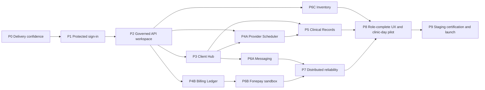

# Tangible Phase Delivery Plan — ClinicFlow

| Field | Value |
| --- | --- |
| Status | Working delivery plan derived from `19-comprehensive-upgrade-plan.md` |
| Delivery principle | Every phase ends with a visible, reviewable workflow—not only internal code or infrastructure |
| Agent model | One integration lead and up to three concurrent bounded agents; schema migrations are serialized |
| Release boundary | Staff-facing clinic system only; client-facing applications and online booking are not in this release |

## 1. What makes a phase complete

A phase is complete only when all four outcomes exist in a staging-like environment:

1. **Visible demonstration:** a staff or platform user can complete a coherent workflow in the web application, or an operator can visibly inspect a concrete delivery/operations artifact.
2. **Authoritative API:** the workflow uses authenticated, tenant-scoped Nest `/api/v1` endpoints; it does not use Next.js Prisma access, seed fallback, or browser-trusted authorization.
3. **Proof:** focused automated tests demonstrate the phase invariants, including negative authorization tests where the workflow is sensitive.
4. **Safe integration:** migrations are rehearsed, observability is adequate for the change, and the integration lead has run the demo and regression checklist.

UI mockups may be developed early, but they do not count as phase completion until they consume the authoritative API and meet the proof requirement.

## 2. Phase map



`P4A` and `P4B` are parallel lanes after P2, although their Prisma migration integration remains serial. `P6A`, `P6B`, and `P6C` are also separate lanes: messaging is non-blocking for core clinic operations, Fonepay is non-blocking for cash/card billing, and Inventory is independent from Finance.

## 3. Blocking and non-blocking view

| Phase | Blocking status | Why it matters |
| --- | --- | --- |
| P0–P2 | Hard blocking | No product-domain work may be released before test safety, default-deny security, sessions, RBAC, archival governance, and API authority exist. |
| P3 Client Hub | Blocks final Client picker, Records, messaging recipient governance, and Client-first terminology completion. | Canonical identity and client history must be trustworthy before clinical workflows. |
| P4A Provider Scheduler | Blocks dependable appointment/Record continuity and appointment-triggered automation. | Booking correctness is a safety-critical clinic workflow. |
| P4B Billing Ledger | Blocks Fonepay and all financial release claims. | Financial history must be immutable before payment integration. |
| P5 Clinical Records | Blocks the integrated visit-completion pilot. | Clinical governance is a release-critical workflow. |
| P6A Messaging | Non-blocking feature lane | Core clinic operations work without it; the global flag keeps rollout safe. |
| P6B Fonepay sandbox | Non-blocking for ordinary billing; blocking for live provider payments | Cash/card/bank methods can ship only after P4B; Fonepay stays sandboxed until certified. |
| P6C Inventory | Non-blocking, independent lane | It must remain separate from Finance and does not block appointments or records. |
| P7–P9 | Hard blocking for production launch | Distributed correctness, operability, accessibility, and recovery evidence are launch gates. |

## 4. Phase cards

### P0 — Delivery confidence

**Covers:** UP-00 and the early foundations of UP-16.

**Visible output**

- A CI run visibly executes formatting, typecheck, web/API builds, Prisma migration validation, dependency/secret checks, and automated tests.
- A synthetic two-clinic test report shows a valid Clinic A user being denied a Clinic B read/write.
- A migration rehearsal report shows apply, startup, smoke query, and forward-repair guidance.

**Work slices**

1. Isolated PostgreSQL test database lifecycle, synthetic factories, and Nest API/integration/E2E harnesses.
2. CI workflow, build artifacts, static rule forbidding operational Prisma imports from Next.js, and migration rehearsal command.
3. Baseline tenancy, scheduling, and billing characterization tests where needed to protect intentional legacy behavior during replacement.

**Hard gate**

- A clean checkout produces a green CI run.
- The tenant-isolation test turns red if its protection is removed.
- The rehearsal never uses staging or production credentials and never uses `prisma db push`.

**Agent wave**

| Owner | Bounded responsibility |
| --- | --- |
| Integration lead | Test conventions, merge order, and migration safety sign-off. |
| Test-platform agent | Isolated database, fixtures, API/E2E harness. |
| CI/security agent | CI, scans, static-boundary check. |
| API-test agent | Two-organization negative tests and reports. |

### P1 — Protected application boundary and secure clinic sign-in

**Covers:** UP-01 and UP-02.

**Visible output**

- Anonymous visitors are sent to sign-in; protected pages show no clinic data.
- Staff sign in and out using a secure cookie session; expired/revoked sessions return to sign-in with a clear message.
- A Settings page exposes session/device information and revoke/sign-out controls when delivered.
- A forced API outage shows a deliberate unavailable state, never direct Prisma or seed data.

**Work slices**

1. Route inventory with explicit classes: authenticated, public, internal worker, provider webhook.
2. Nest global default-deny guard, minimal public-route metadata, server-derived tenant/location context, CORS/security headers/rate limiting, correlation IDs.
3. Server session persistence, secure cookie issuance, CSRF, expiry/rotation/revocation/logout, secret validation, and removal of bearer/localStorage transport.
4. Web login/logout/expiry states and removal of unauthenticated Next mutation/fallback paths.

**Hard gate**

- Every operational route is classified and protected by default.
- Browser storage contains no application token.
- Missing/forged CSRF proofs fail state-changing requests.
- Anonymous and cross-tenant requests fail across every current module without identifier leakage.

**Dependencies:** P0.

**Agent wave**

| Owner | Bounded responsibility |
| --- | --- |
| Integration lead / security owner | Global guard, route classes, Nest request context; exclusive owner of shared security wiring. |
| Auth-data agent | Session schema, revocation/rotation, auth service migration. |
| Web-auth agent | Cookie-aware web transport and visible sign-in/session UX. |
| Security-QA agent | CSRF, revocation, anonymous/cross-tenant, rate-limit and outage-state tests. |

### P2 — Governed API workspace and platform control

**Covers:** UP-03, UP-04, and the first scoped read model from UP-08.

**Visible output**

- An Owner assigns multiple roles and optional location scope to a staff member; navigation/actions visibly change by server capability.
- The Archive Center displays archived items, retention/legal-hold status, and an Owner-only confirmation flow. An Admin cannot finalize deletion.
- A Super Admin sees only de-identified platform metrics, global feature flags, organization overrides, and audited time-bound support grants.
- Receptionist, Provider, Finance, Owner, and Super Admin each sign in to a capability-aware dashboard that loads from small `/api/v1` calls.

**Work slices**

1. Memberships, additive role assignments, Finance/Inventory Manager roles, location scope, effective/revoked dates, audit history, restrictive scalar-role backfill, and capability evaluation.
2. Shared archive → Owner-confirmed permanent deletion primitive; legal hold/retention checks; tombstone audit; safe relation policy review.
3. Platform feature flags, per-organization overrides, de-identified usage events, Super Admin aggregate workspace, and time-bound support grants.
4. `/api/v1` response/errors/idempotency/pagination conventions; authenticated bootstrap/dashboard read models; remove oversized `operational-data` and direct Prisma fallback.

**Hard gate**

- Role/location scope is enforced by the API, not only hidden in the UI.
- Existing ambiguous role backfills are quarantined for review rather than broadly privileged.
- Only an Owner can permanently delete an eligible archived item after explicit confirmation; legal hold/retention prevents final deletion.
- A repository import scan proves Next operational code no longer uses Prisma for the completed dashboard/bootstrap surface.
- Super Admin cannot browse standing Client or Record data without a reasoned, time-limited support grant.

**Dependencies:** P1.

**Agent wave**

| Owner | Bounded responsibility |
| --- | --- |
| Integration lead / policy owner | Prisma schema train, capability contract, v1 convention approval. |
| RBAC-governance agent | Role assignment, authorization policy, archival/tombstone primitives. |
| Platform agent | Feature flags, aggregate metrics, support grants and platform API. |
| Workspace agent | Bootstrap/dashboard v1 API and capability-aware dashboard/role/archive UI. |

### P3 — Client Hub

**Covers:** UP-05 plus its Client read model.

**Visible output**

- Reception staff use `/clients` to search, create, view, archive, and merge Clients.
- The system permits two Clients with the same family phone number, warns about duplicates, and assigns each a unique immutable Client code.
- A merge review visibly preserves appointments, finance, communications, and Record history while the secondary Client becomes archived and linked.

**Work slices**

1. Atomic per-organization Client-code allocation; normalized contact/search fields; removal of unique-phone constraint through expand/contract migration.
2. Duplicate detection, aliases, merge history, conflict-review, authorized repair/unmerge procedure, and archive-not-delete behavior.
3. `/clients` API/UI, legacy `/customers` compatibility, terminology migration across this workflow, Client profile/timeline read model.

**Hard gate**

- Concurrent Client creation always produces unique codes.
- Shared phones work without cross-tenant search leakage.
- Merge never physically deletes the secondary Client or its history.
- Client terminology is visible in the delivered route/screen/API contract; legacy compatibility is measured and temporary.

**Dependencies:** P2.

**Agent wave**

| Owner | Bounded responsibility |
| --- | --- |
| Integration lead | Client migration review and compatibility cutover. |
| Client-core agent | Schema/API, duplicate/merge/archive logic. |
| Client-UX agent | Directory/profile/duplicate/merge user flow against fixture contract. |
| Client-QA agent | Shared phone, allocation concurrency, merge preservation, tenant and permission denials. |

### P4A — Provider Day Scheduler

**Covers:** UP-06 and UP-10 plus the schedule read model.

**Visible output**

- Staff view a provider-first day/week schedule at `/schedule`, book a Client with a provider/service, and see a 15-minute AD-first grid with optional labelled BS equivalent.
- Staff can confirm, check in, begin, complete, cancel, no-show, and reschedule using distinct visible workflow actions.
- A concurrent booking demonstration rejects the second booking with a clear “slot no longer available” state; a reschedule visibly preserves the original plus successor.

**Work slices**

1. AD default migration; centralized AD/BS conversion; location IANA timezone behavior; availability effective dates, blocks, buffers, provider-service rules, 12-month horizon, 15-minute cadence.
2. Provider-only booking validation and PostgreSQL transaction/exclusion constraint or equivalent database guard; remove chair/resource conflict authority.
3. Named lifecycle commands, required cancellation/no-show rules, successor reschedule transaction, atomic audit/workflow/outbox events.
4. Provider schedule/booking/reschedule UI and schedule read model with loading/empty/denied/conflict states.

**Hard gate**

- No simultaneous request can double-book the same provider; different providers never falsely conflict.
- Resource/chair data cannot block a release booking.
- AD is the persisted/default date; BS is derived display only.
- Generic status update endpoints no longer permit invalid transitions.

**Dependencies:** P2 for API/policy; P3 is required for the final Client picker, though scheduling core can use a temporary compatibility reference before P3 finishes.

**Agent wave**

| Owner | Bounded responsibility |
| --- | --- |
| Integration lead | Concurrency approach, schema migration, lifecycle contract. |
| Scheduling-core agent | Timezone/availability/provider guard/lifecycle API. |
| Calendar and schedule-UX agent | AD/BS presentation, board, booking/reschedule dialogues. |
| Scheduling-QA agent | Concurrent booking, timezone, buffers, effective dates, transition tests. |

### P4B — Billing and Cash Ledger

**Covers:** UP-07 plus finance read models.

**Visible output**

- Receptionist creates a draft invoice and records an eligible partial payment on an issued invoice.
- Finance/Owner issues invoices and sees an immutable ledger-style payment history, balance, aging, and reconciliation exceptions.
- An attempted completed-payment edit/delete is visibly rejected. Refund, reversal, and void appear as linked correction workflows, not edit buttons.

**Work slices**

1. Financial schema migration: NPR decimals/currency, locations, frozen snapshots, sequence-safe invoice numbers, archive/retention, idempotency, correction/approval/reconciliation models.
2. Explicit draft, issue, void/cancel, record-payment, refund, reversal, reconciliation commands; retire generic payment/invoice mutation/delete paths.
3. Transactional totals/balance/overpayment protection and role-specific Finance/Receptionist/Owner approval policy.
4. Invoice, payment ledger, correction approval, aging, and reconciliation-exception read models and UI.

**Hard gate**

- Issued invoice snapshots and completed receipts cannot be edited/deleted.
- Parallel payment attempts cannot over-collect.
- Receptionist can record only an eligible payment and is denied issuance, correction, refund, void, deletion, and reconciliation actions.
- Inventory has no automatic effect on this ledger.

**Dependencies:** P2; canonical Client integration follows P3 but a compatibility Client reference is allowed during development.

**Parallel status:** Can develop alongside P4A after P2. The two teams must not integrate Prisma migrations concurrently; the integration lead schedules a serial schema train.

**Agent wave**

| Owner | Bounded responsibility |
| --- | --- |
| Integration lead | Finance migration train, financial data reconciliation/cutover. |
| Finance-core agent | Ledger schema, commands, atomic accounting rules. |
| Finance-UX agent | Invoice/receipt/correction/reconciliation screens. |
| Finance-QA agent | Authority, concurrency, immutability, historical-data reconciliation tests. |

### P5 — Clinical continuity: Records and charts

**Covers:** UP-09.

**Visible output**

- From a completed appointment, an Assistant saves a Record draft; the assigned Provider signs it; the signed Record becomes visibly immutable.
- A correction creates a clearly linked, reasoned amendment timeline rather than overwriting content.
- Dental chart history visibly shows append-only revisions with actor and source Record.

**Work slices**

1. Record draft/sign/amend commands, immutable versions, audit/legal-hold policy, and safe legacy `AppointmentSession` transition.
2. Append-only dental-chart snapshots/revisions tied to authorized actor and source Record.
3. Record editor, signing confirmation, amendment timeline, stale-draft recovery, and Client clinical timeline.

**Hard gate**

- Signed clinical content cannot be overwritten or routinely deleted.
- Assistant may draft but cannot sign; Provider clinical read/write/sign policy is enforced server-side.
- Amendments retain original content, actor, time, and reason.
- Archive/retention rules cannot bypass legal hold.

**Dependencies:** P3 Client Hub and P4A appointment lifecycle.

**Agent wave**

| Owner | Bounded responsibility |
| --- | --- |
| Integration lead | Clinical migration/retention review and compatibility path. |
| Record-core agent | Record versioning/signature/amendment commands. |
| Chart and Record-UX agent | Chart revisions and clinical editing/timeline UX. |
| Clinical-QA agent | Provider/Assistant policy, immutability, archive and migration tests. |

### P6 — Controlled integrations and independent back office

P6 is three separately demonstrable lanes. They can be developed in parallel after their listed prerequisites, but each is feature-flagged until its own gate passes.

#### P6A — Messaging Control Centre

**Covers:** UP-12.

**Visible output:** Super Admin toggles SMS/WhatsApp globally at `/platform/features`; a clinic Owner sees configuration/template/contact readiness; staff sees queued, delivered, failed, and cancelled history. Turning the global flag off visibly prevents a new/queued delivery.

**Dependencies:** P2 global flags, P3 Client contact governance. Actual provider delivery additionally needs P7 workers/outbox; configuration and intent workflows can start earlier.

**Gate:** global off overrides all clinic configuration; no send occurs without configuration/consent/contact eligibility; retries are idempotent; delivery failure does not silently alter appointment state; secrets/content are not leaked.

#### P6B — Fonepay sandbox and payment reconciliation

**Covers:** UP-11.

**Visible output:** Finance starts a Fonepay sandbox payment intent from an issued invoice. The UI shows pending verification, one verified receipt after signed callback, and a reconciliation trail. Replaying the callback produces no second receipt; exceptions appear in a queue.

**Dependencies:** P4B Finance Ledger, P2 feature controls, P7 worker/outbox runtime, clinic credentials/configuration.

**Gate:** browser redirect is never payment proof; callbacks are signature-verified/idempotent; live enablement needs global flag + clinic configuration + Owner/Admin approval + sandbox evidence + provider onboarding.

#### P6C — Inventory Operations

**Covers:** UP-13.

**Visible output:** Inventory Manager receives stock, views location balances/reorder alerts, transfers or counts stock with a reason, and opens immutable movement history. Finance screens do not change.

**Dependencies:** P2 Inventory Manager role and governance. It is independent of Finance/Scheduling and can begin as soon as the schema train has a safe migration window.

**Gate:** balances derive only from immutable movements; corrections are compensating movements; tenant/location denials work; no inventory action creates an invoice, payment, COGS, or accounting entry.

**P6 agent topology**

| Lane | Core agent | UX/integration agent | QA agent |
| --- | --- | --- | --- |
| Messaging | policy, intents, provider contract | settings/history/delivery UI | global-off, consent, retry test evidence |
| Fonepay | accounts/intents/webhook/reconciliation model and adapter | payment status/readiness/exception UI | signature, replay, timeout, balance tests |
| Inventory | items/movements/balances/location authorization | receive/count/transfer/catalog UI | stock concurrency, rebuild, separation tests |

Only one lane may own a schema migration integration at a time. Another lane may work against contract fixtures or an isolated worktree while it waits.

### P7 — Distributed reliability and observable operations

**Covers:** UP-14 and the operational portions of UP-16.

**Visible output**

- Two API instances show the correct scoped schedule/billing/Client widget after a mutation; cache invalidation is observable in a Redis/dashboard view.
- A worker dashboard shows outbox jobs, retries, dead-letter/reconciliation state, and notification/payment correlation IDs.
- A deliberate Redis failure produces correct authoritative API/PostgreSQL behavior with a clear degraded state, never incorrect booking or finance data.

**Work slices**

1. Redis cache adapter with tenant/scope/version keys, TTL/invalidation metrics, and bounded browser cache.
2. Durable workers/outbox for messaging, Fonepay/reconciliation, scheduled work, idempotency, and observability.
3. Container/deployment manifests, health/live + health/ready, structured logs, traces, metrics, error tracking, queue/cache alerts.

**Hard gate**

- Cache and worker are never source of truth for scheduling, clinical, or financial data.
- Multi-instance invalidation, job replay, and degraded dependency tests pass.
- Cache key isolation and observability/load evidence are recorded.

**Dependencies:** P2 scoped API foundation; activation of a domain worker waits until its domain contract exists. P6A/P6B production delivery depends on this phase.

**Agent wave**

| Owner | Bounded responsibility |
| --- | --- |
| Integration lead | Runtime architecture, deployment/migration coordination. |
| Cache/worker agent | Redis keys, outbox, queue consumers, idempotency. |
| Web resilience agent | Cache-aware refresh and degraded/unavailable UI states. |
| Observability/QA agent | Health/telemetry/alerts, multi-instance and load/failure evidence. |

### P8 — Role-complete UX and one-clinic-day pilot

**Covers:** UP-15 and remaining scoped read models from UP-08.

**Visible output**

Run the full staff pilot in one staging clinic:

1. Receptionist finds or registers a Client.
2. Staff book and reschedule a provider-first appointment on the AD-first schedule.
3. Assistant drafts and Provider signs a Record/amendment.
4. Finance issues an invoice; Receptionist records a permitted payment; correction controls appear only to authorized roles.
5. Messaging shows enabled/disabled delivery policy and history; Fonepay sandbox is pending/verified/exceptioned as appropriate.
6. Inventory Manager posts movements with no finance side effect.
7. Owner uses role and archive controls; Super Admin sees aggregate metrics and audited support access only.

The same flow is demonstrated for Owner/Admin/Receptionist/Provider/Assistant/Finance/Inventory Manager/Super Admin, on desktop and mobile, including keyboard-only and error/retry paths.

**Hard gate**

- Every sensitive visible action has a matching server-denial test.
- All core screens have loading, empty, denied, conflict, and unavailable states.
- WCAG 2.2 AA automated/manual evidence, client-first terminology, responsive behavior, and AD/BS labels are complete.

**Dependencies:** P3, P4A, P4B, P5, P6C, and P7; P6A/P6B appear when their flags and respective gates are complete.

### P9 — Staging certification and production launch

**Covers:** the final remainder of UP-16.

**Visible output**

- A CI/CD deployment dashboard identifies immutable web/API/worker artifact versions and controlled `prisma migrate deploy` execution.
- Staging exposes health/readiness, traceable web → API → worker flows, metrics/alerts, and tested feature-flag kill switches.
- The release evidence pack includes backup/restore drill, security assessment, scheduling/financial concurrency tests, provider webhook test, incident exercise, named on-call owner, and launch sign-off.

**Hard gate**

- Environments, secrets, callbacks, Redis, and databases are isolated.
- Restore, alert, rollback/forward-fix, performance, security, and incident rehearsals are successful and recorded.
- No clinic rollout occurs without the complete evidence pack and Super Admin integration flags remain off for any uncertified provider.

**Dependencies:** P7 and P8, plus every release-critical domain gate.

## 5. Agent orchestration rules

### Capacity and ownership

The current workspace supports **four active agents total**. Use this topology in each phase:

```text
Integration lead (root)
├── Core/domain agent        — owns one module’s commands and tests
├── UI/read-model agent      — owns only the matching API consumer and UI
└── QA/security/ops agent    — owns invariant, migration, and demo evidence
```

An agent may spawn a subagent only by freeing/replacing its own bounded work or when an active slot is available. More agents do not make shared-boundary work faster. In particular, only the integration lead may approve changes to:

- `prisma/schema.prisma` and migration ordering;
- Nest authentication, authorization, request-context, and API-v1 conventions;
- shared capability types and web workspace state/navigation;
- contract changes that affect more than one domain.

### Parallel work rules

| Situation | Allowed parallel work | Must remain serial |
| --- | --- | --- |
| Before P2 | Test/CI, route inventory, auth UX, and security tests after contracts are agreed. | Global guard/session/auth context changes. |
| P3/P4/P4B | UI fixtures, API tests, and domain code in separate worktrees. | Prisma migration integration and shared Client/capability contracts. |
| P6 lanes | Messaging, Fonepay, and Inventory may develop in separate worktrees. | Schema train, worker-runtime wiring, provider secrets/configuration, global feature flags. |
| P7/P8 | Cache/worker implementation, resilience UI, observability/load tests. | Enabling production delivery/traffic and final launch gate. |

### Agent task contract

Every agent task must state:

1. the exact phase and work slice;
2. allowed files/modules and shared boundaries it must not edit;
3. API/schema contract assumptions;
4. required tests and the visible demo contribution;
5. migration or external-state risk; and
6. final handoff: changed files, tests run, demo steps, unresolved risks.

The integration lead—not an individual agent—runs the migration rehearsal, full suite, authorization review, and phase demo before marking the phase complete.

## 6. Recommended next move

Start **P0 — Delivery confidence**. It has a tangible CI/test/migration report, does not alter clinic behavior, and gives the team safe feedback before the security-critical work in P1. Once P0 passes, execute P1 as the first user-visible change: protected sign-in with no public clinic data or Prisma fallback.

## 7. Plan maintenance

- Track each phase as a parent task and each work slice as a bounded child task.
- Keep `docs/19-comprehensive-upgrade-plan.md` as the technical work-package source and this document as the sequencing/demo source.
- Update `docs/18-decision-log-and-adrs.md` for material decisions about session implementation, PostgreSQL exclusion/lock approach, queue/cache runtime, payment provider contract, or retention law/policy.
- Reconcile existing uncommitted application changes against the active phase before editing overlapping files; do not discard or overwrite them implicitly.
