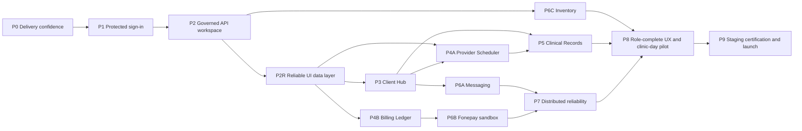

# Tangible Phase Delivery Plan — ClinicFlow

| Field | Value |
| --- | --- |
| Status | Working delivery plan derived from `19-comprehensive-upgrade-plan.md` |
| Delivery principle | Every phase ends with a visible, reviewable workflow—not only internal code or infrastructure |
| Agent model | One integration lead and up to three concurrent bounded agents; schema migrations are serialized |
| Release boundary | Staff-facing clinic system only; client-facing applications and online booking are not in this release |

## 1. What makes a phase complete

A phase is complete only when all four outcomes exist in a staging-like environment:

1. **Visible demonstration:** a staff or platform user can complete a coherent workflow in the web application, or an operator can visibly inspect a concrete delivery/operations artifact.
2. **Authoritative API:** the workflow uses authenticated, tenant-scoped Nest `/api/v1` endpoints; it does not use Next.js Prisma access, seed fallback, or browser-trusted authorization.
3. **Proof:** focused automated tests demonstrate the phase invariants, including negative authorization tests where the workflow is sensitive.
4. **Safe integration:** migrations are rehearsed, observability is adequate for the change, and the integration lead has run the demo and regression checklist.

UI mockups may be developed early, but they do not count as phase completion until they consume the authoritative API and meet the proof requirement.

## 2. Phase map



`P4A` and `P4B` are parallel lanes after P2R, although their Prisma migration integration remains serial. `P6A`, `P6B`, and `P6C` are also separate lanes: messaging is non-blocking for core clinic operations, Fonepay is non-blocking for cash/card billing, and Inventory is independent from Finance.

### 2.1 Active priority update — guided booking and Client intake (2026-07-25)

This priority update supersedes the current single-page booking form and the transitional direct-time/availability toggle. Booking remains provider-based, AD/ISO remains canonical, BS remains derived, and phone matches never auto-select or auto-merge a Client.

#### Product decisions

| Decision | Approved direction |
| --- | --- |
| Date control | Replace the large custom calendar interaction with a compact native-like date popover. Native `<input type="date">` remains the accessible AD fallback, but the browser-native popup cannot be styled consistently enough to be the only control. The shared popover must behave like a native picker, support keyboard navigation, and show derived BS context without persisting BS values. |
| Global entry | Add a persistent **Book appointment** action to the desktop top bar and retain the mobile quick-book action. It opens the same URL-addressable booking drawer over the current page rather than navigating away and losing context. |
| Booking structure | Use one guided drawer with two paths: **Client first** and **View slots first**. Both converge on one confirmation and authoritative submit operation. |
| New Client intake | Capture name and phone, with address optional, plus **Visited this clinic before**. The checkbox raises an identity-review signal; it never merges records automatically. |
| Duplicate review | After minimal Client intake, show possible matches before confirmation. Reception or a Provider handling a new caller may select an existing Client or explicitly continue with a new Client. |
| Multiple phone numbers | Add a first-class Client phone/contact model. If an entered number differs from the selected Client's existing numbers, append it with audit history; do not overwrite the primary number silently. Shared household numbers remain valid. |
| Optional details | Confirmation shows core booking facts first. Location, notes, and future secondary fields live in a collapsed **Additional details** section. |
| New Client screen | Replace the centered New Client modal with the same responsive right-side drawer pattern used by booking: 480px desktop, full-screen mobile, fixed header/footer, preserved draft, and deliberate dirty-close handling. |
| Interaction surfaces | Use the responsive right-side drawer for every create, update, detailed review, configuration, and multi-field workflow across clinic and platform screens. Drawers retain the underlying page context, use fixed actions, trap and restore focus, support Escape/backdrop close when safe, and become full-screen on mobile. A compact centered confirmation is reserved only for a brief yes/no destructive decision; it must not become another data-entry form. |

#### Priority implementation order

| Priority | Tangible delivery | Blocking relationship |
| --- | --- | --- |
| B0 — shared interaction drawer | **Implemented foundation; manual QA pending.** The appointment drawer is now the shared primitive and legacy form modals route through it. Explicit fixed-footer and dirty-close call-site cleanup remains. | Foundation for every following UI slice; can ship independently of schema/API work. |
| B1 — native-like date primitive | **Implemented in source and automated tests; authenticated visual QA pending.** The compact AD-first picker includes a native input fallback, derived BS context, focus return, Escape close, grid keyboard movement, month navigation, bounds, and mobile-safe sizing. | Unblocks B2–B4 UI work. |
| B2 — global Quick Book and guided drawer shell | **Implemented in source and automated tests; authenticated visual QA pending.** Authorized users receive the same desktop/mobile Quick Book entry on every clinic route without route loss. The shared shell owns URL/back behavior, capability-aware location selection, lazy bounded references, loading/retry states, fixed actions, and dirty-close confirmation. The existing single-form booking content now consumes explicit location references; the complete Client-first and slot-first guided contents remain B3/B4. | Unblocks B3/B4 UI integration. |
| B3 — Client-first flow | **Implemented in source and automated tests; authenticated visual QA pending.** Global Quick Book now opens with debounced phone-first matching or a bounded recent-Client list, never auto-selects a match, offers role-gated minimal New Client intake (name, phone, optional address, prior-visit checkbox), preserves its typed draft through URL-addressed steps, and continues through Provider/service/AD-first date/live-slot/priority details plus explicit possible-match review. A basic **View slots first** handoff preserves the chosen appointment details for B4 refinement. | Uses the completed B5 identity contracts and now converges on the B6 atomic confirmation command. |
| B4 — slot-first flow | **Implemented in source and automated tests; database migration applied; authenticated visual QA pending.** Provider/date/service/priority produce API-ranked slots with the first five disclosed first. Selecting a slot creates a server-expiring, tenant-scoped hold; the held summary and countdown persist through the shared Client/match flow, changes release the hold, stale availability returns a refreshable conflict, and uncertain retries reuse the same request key. Provider and hold row locks, request hashes, DB-time expiry, an actor hold cap, and terminal-state checks protect the preview-to-confirmation boundary. | B4 now hands its exact hold to B6 for transactional validation and consumption. Migration `20260725_000014` was applied through the Supabase session pooler on 2026-07-26. |
| B5 — match review and multiple-phone identity | **Implemented in schema/API, migrated to Supabase, and consumed by B3; authenticated manual QA pending.** `ClientPhone` supports audited multiple numbers and shared household contacts, number-first matching is tenant-scoped and advisory, booking compatibility paths append rather than overwrite, and prior-visit/skipped-match signals create versioned identity-review items. | B3 now consumes the contracts with explicit advisory match review. B4/B7 consumption and authenticated QA remain. |
| B6 — confirmation and authoritative submit | **Implemented, migrated, independently reviewed, and PostgreSQL concurrency-tested; authenticated visual QA pending.** Both guided paths converge on one summary and one `POST /api/v1/booking/confirm` command. A serializable transaction locks the idempotency key and Provider, derives current service/provider timing, validates availability and the exact hold, resolves existing/new Client identity with mandatory candidate-set versioning, appends permitted phones, creates audit/workflow evidence and appointment, consumes the hold, and stores a replayable receipt. The UI preserves the exact payload/key across uncertain retries and shows success only from the durable server result. | Migration `20260726_000015` is applied. Real Supabase-backed tests prove concurrent same-key replay, same-slot exclusion, identity-phantom retry, expired-hold denial, and rollback after Client creation. Manual authenticated/responsive QA remains the release evidence gap. |
| B7 — standalone New Client drawer | **Implemented in source, migrated to Supabase, independently reviewed, and database-tested; authenticated visual QA pending.** `/clients` now uses the shared responsive drawer and minimal intake fields, number-first candidate review, explicit use-existing/continue-new choices, optional expanded details, AD DOB with derived BS context, dirty-close protection, capability gating, safe retry, and server-confirmed success. Receptionists and Providers may create a caller or append a caller phone after match review; Provider authority does not include general correction/archive/merge. Creation is one serializable, idempotent Client/chart/phone/review/audit/receipt transaction. | Reuses B2/B5/B6 identity primitives. Migration `20260727_000016` adds the replay receipt, `000017` binds its lifecycle to Client purge, and `000018` redacts pre-fix receipt payloads. |
| B8 — responsive and native-feel certification | After the functional booking and domain flows stabilize, perform a system-wide responsive pass across every route, drawer, form, list, table, schedule and platform screen. Verify reflow, orientation, safe areas, touch/keyboard input, native controls, text scaling and performance on representative mobile, tablet, laptop and large-desktop sizes. | Deliberately late fit-and-finish lane so unstable workflows are not polished repeatedly; becomes a hard P8/P9 release gate. |

#### Guided state machines

**Client-first**

1. Open Quick Book → phone-number search.
2. Select an existing Client, choose **New entry**, or choose **View slots first**.
3. For New entry: name + phone required, address optional, prior-visit checkbox optional.
4. Appointment details: large provider buttons, native-like date picker, service/duration, ranked slots, priority.
5. If New entry produced possible matches: select a Client or explicitly skip.
6. Confirmation: core summary plus collapsed Additional details.
7. Server-confirmed booking success.

**Slot-first**

1. Choose **View slots first**.
2. Select provider, date, service/duration, available slot, and priority.
3. Create a three-minute configurable hold only for the selected slot.
4. Open the shared phone-first Client step with the selected-slot summary pinned above it.
5. Select an existing Client or use New entry; run the same possible-match review.
6. Confirmation and authoritative hold-to-appointment conversion.

#### Schema and API work

1. Add `ClientPhone` (organization, Client, raw value, normalized value, label/type, primary flag, verification/source metadata, archive timestamps). Index organization + normalized value for matching; allow the same normalized number on multiple Clients; prevent only duplicate active copies for the same Client.
2. Backfill `Customer.phone` into `ClientPhone`, dual-read during migration, then make the scalar field a measured compatibility projection rather than the contact authority.
3. Add an identity-review record/status for prior-visit claims, skipped possible matches, and provisional/new Clients requiring later reconciliation. Store candidate IDs/scores and resolution audit data; never auto-merge.
4. Add number-first match and minimal intake contracts that return strong/possible/shared-household matches with directory-safe fields only.
5. Add an audited append-phone command used when reception selects an existing Client with a new number.
6. Add availability-search, create/release/expire-hold, and hold-to-appointment contracts. Return the best three-to-five slots first and create no hold until one slot is selected.
7. Require an idempotency key for final booking; the server performs the final overlap/hold validation and Client association in one concurrency-safe operation.

#### Manual acceptance checklist

- Quick Book opens from Dashboard, Clients, Schedule, Billing, Staff, Settings, and Records without losing the underlying route.
- Browser Back closes the drawer one step/overlay at a time; reopening preserves no stale cross-Client draft.
- Client-first and slot-first paths reach the same confirmation payload.
- Schedule-cell launch preselects the slot and enters the shared Client step.
- A shared household number shows every relevant Client and requires human selection.
- A new number selected for an existing Client is appended, not substituted; selecting Skip creates a new Client and identity-review item.
- Prior-visit selection queues review but does not merge.
- Expired hold, concurrent booking, network retry, and double-click preserve the draft and create at most one appointment.
- The picker and drawer are keyboard operable and visually contained at 360px, 768px, and desktop widths.
- Client, billing, Record, schedule, staff, access-role, settings, and platform create/update forms open from the right without replacing the underlying page; focus stays within the drawer and returns to the launching action on close.
- The final B8 certification covers 320/360/390/430px phones, 768/820px tablets in both orientations, 1024px compact desktop, 1280/1440px standard desktop, and 1920px large desktop. It also checks browser zoom to 200%, OS text scaling, notched-device safe areas, coarse-pointer touch targets, virtual keyboards, reduced motion, keyboard-only use, and no hover-only action.

### 2.2 Parallel audit checkpoint — 2026-07-25

Three independent read-only audits compared the plans with the current frontend, backend, Prisma schema, migrations, and review evidence. The result is that no complete release phase has met every hard gate yet, although several correctness foundations are strong.

| Area | Current state | Most important remaining work |
| --- | --- | --- |
| P0–P1 delivery/authentication | Core session, CSRF, default-deny, CI/test and secret-check foundations exist. | Green remote CI/staging evidence, device/session management, reset/activation, privileged MFA, distributed throttling, and broader database-backed denial tests. |
| P2–P2R workspace/data layer | Dashboard and Client routes use bounded v1 read models; every clinic route receives a small capability-aware workspace bootstrap; the selected-location booking bootstrap, global Quick Book controller/surface, and session-local deduplicated frontend loader are implemented; shared drawer foundation exists. | Retire `/operational-data` from Archive, Billing, Schedule, Settings, and Staff; add the remaining typed query/mutation layer, optimistic rollback, prefetch, performance evidence, and authenticated responsive QA. |
| P3 Client identity | `ClientPhone`, Nepal-aware normalization/backfill, scalar compatibility dual-read/write, shared household contacts, advisory number-first matching, audited append-phone, versioned identity review, governed phone-preserving merge, and B7 standalone governed Client creation are implemented. Migrations through `20260727_000018` are applied to Supabase. Real PostgreSQL evidence covers same-key replay, different-key identity races, and receipt-failure rollback. | Authenticated browser QA, broader merge/repair UI, and production load evidence remain. |
| P4A scheduling | Provider availability, strict real-AD date validation, duration-aware slot calculation/cache identity, active-canonical Client enforcement, lifecycle commands, successor reschedule, database overlap exclusion, global Quick Book, both guided paths, v1 ranked availability, short-lived slot holds, and B6 atomic confirmation exist and are migrated. | Collect authenticated responsive/browser QA and performance evidence, then complete the remaining route-owned data boundaries. |
| P4B Finance | **Implemented, migrated, independently reviewed, and database-tested; authenticated visual QA pending.** Location-scoped v1 Finance supports idempotent draft creation/issuance/payment recording, immutable receipt/correction ledger, Refund/Reversal approval separation, daily reconciliation, responsive drawers, retired legacy mutations, and real PostgreSQL overcollection/over-reservation proof. | Authenticated role/mobile QA remains release evidence. Fonepay/provider settlement stays in P6B; archive/retention and persisted exception resolution remain later governed work. |
| P5–P7 later domains | Documentation and limited adjacent models/roles exist. | Governed Records, messaging delivery platform, Fonepay, Inventory, workers/outbox, Redis/distributed controls, and observability are not implemented as complete domains. |

#### Reconciled implementation order

1. **Completed:** B1 verification is green; retain the repository build/test baseline as a continuous gate.
2. **Completed:** archived/merged Clients are rejected, custom duration is honored and cache-isolated, and AD date keys are strictly validated as real Gregorian dates.
3. **Partially completed:** the selected-location booking bootstrap, shared booking authorization, per-location capability map, and failure-isolated frontend loader are complete. Finish the remaining Archive, Billing, Schedule, Settings, and Staff route-owned data boundaries without blocking the now-ready Quick Book reference contract.
4. **Completed in source and automated tests; authenticated visual QA pending:** B2 global desktop/mobile Quick Book opens without leaving the current route and consumes the selected-location booking bootstrap.
5. **Completed in schema/API and applied to Supabase; guided UI/manual QA pending:** B5 `ClientPhone`, identity review, backfill/dual-read, number-first matching, audited append-phone behavior, and phone-preserving merge.
6. **Completed in source and automated tests; authenticated visual QA pending:** B3 Client-first guided booking consumes the B5 number-first identity contracts; B7 will reuse the same intake/match primitives.
7. **Completed in source and automated tests; migration applied; authenticated visual QA pending:** B4 versioned ranked availability, selected-slot holds, retry-safe hold idempotency, countdown/release handling, and the shared ready handoff.
8. **Completed in source, Supabase, unit tests, and PostgreSQL integration tests; authenticated visual QA pending:** B6 durable idempotent confirmation covers final availability/hold validation, Client selection or creation, multiple-phone append/review evidence, appointment creation, audit/events, hold consumption, rollback, and replay of the completed result.
9. **Completed in source, Supabase, unit tests, independent review, and PostgreSQL integration tests; authenticated visual QA pending:** B7 standalone New Client reuses the governed booking intake/match primitives, rejects stale candidate evidence, and commits a replay-safe minimal receipt without duplicating clinical PII.
10. Close Finance UI/reconciliation before beginning the governed Record domain.

### 2.3 Clinic review reprioritization — 2026-08-15

The current clinic review makes responsiveness and latency a release-blocking usability concern. Correct domain behavior remains mandatory, but new domain expansion must not hide a slow or unusable core clinic loop.

| Order | Work package | Tangible review output | Scheduling decision |
| --- | --- | --- | --- |
| R0 | Immediate navigation and permission defects | Sidebar actions remain reachable at every desktop height; Schedule has one visible page heading; Providers can open governed New Client intake from Quick Book and `/clients`; mobile navigation says Clients. | Fix now. These are regressions in already-approved behavior. |
| R0A | Proper Sign out control | A clearly labelled **Sign out** action remains visible/reachable in the anchored desktop footer and mobile/profile surface at short heights, 200% zoom, keyboard-only use, and touch sizes. One click becomes pending/disabled, revokes the active server session, clears tenant caches and sensitive drafts, notifies other tabs, and returns to sign-in without a clinic-data flash. Expired/revoked sessions use the same cleanup path; “sign out all devices” is a separate future control. | Implemented 2026-08-16 with acknowledged server revocation, failure recovery, dirty-booking protection, cross-tab cleanup, and shared clinic/platform controls. Signed-in responsive and failure-injection QA remains the acceptance gate. |
| R0I | Inventory Operations | Deliver a Finance-independent, location-scoped Inventory workspace with an item catalog, suppliers, reorder thresholds, balances, receiving, usage, adjustment, stocktake, transfer, lot/expiry tracking, and immutable movement history. Owner/Admin and Inventory Manager permissions are enforced by location; negative stock and direct movement edits/deletes are rejected; archive-first item lifecycle and audit history are mandatory. | **Implemented 2026-08-16.** Migrations 000024/000025 are applied to Supabase; the bounded v1 API, responsive workspace, audited catalog/reorder editing, idempotent stock commands, archive/restore/Owner-confirmed purge, and Finance separation tests pass. Signed-in role/location, mobile, and real workflow browser QA remains the phase acceptance gate before release certification. |
| R1 | Performance baseline and request-waterfall reduction | Record p50/p95 API duration, payload size, query count, and time-to-useful-content for login, Dashboard, Clients, Finance, Day/Week/Month Schedule, and booking confirmation. Remove serial bootstrap requests and duplicate schedule reads; add route-owned read models, request cancellation/deduplication, a persistent shell skeleton, and route-transition cache reuse that does not repeat session/workspace bootstrap. | **Core boundary implemented 2026-08-22; measurement gate remains.** Every frontend route is route-owned, the compatibility aggregate has no frontend caller, Settings is bounded, Day Schedule uses one v1 snapshot, adjacent days prefetch into a bounded cache, superseded visible Schedule reads are aborted, and session/mutation invalidation is scoped. Representative-volume p50/p95, query-plan, and payload evidence remain before R1 closes. |
| R1S | Professional Staff Management | Replace the compatibility Staff page with a bounded v1 Staff read model and a refined responsive workspace: summary counts, search, role/location/status filters, sortable/paginated desktop table, equivalent mobile cards, clear chips, and right-side drawers for permitted create/invite/edit/role/location/provider-link/deactivate/archive/restore actions. Loading, empty, denied, unavailable, retry, audit, and capability states are first-class. | **Implemented 2026-08-22; signed-in QA pending.** The bounded Staff contract, location-aware Manager view, Owner/Admin commands, additive Finance/Inventory Manager roles, server-searchable role grants, responsive directory, skeleton/error states, and confirmation drawers are in place. |
| R2 | Booking perceived performance | Confirmation immediately enters a clear pending state, is retry-safe, and lets unrelated route content remain usable. Follow-up refreshes happen optimistically or in the background after the authoritative booking commit. | **Implemented in source 2026-08-22; signed-in slow-network QA pending.** Slow confirmation minimizes after 400 ms into a persistent background status surface, keeps the protected idempotent request mounted, never claims success before PostgreSQL confirms, and reopens for deterministic retry/attention. |
| R3 | Reservation calendar interaction | Replace the current dense boards with a virtualized, provider-based calendar surface offering seamless day/week/month navigation, sticky time/provider axes, direct slot actions, keyboard/touch support, and AD-first dates with optional BS context. Evaluate maintained calendar packages against bundle size, accessibility, virtualization, timezone, customization, and license before adoption. | **Core interaction refinement in progress 2026-08-22.** The bounded Day board now has sticky provider/time axes, direct slot actions, mobile Provider lists, AD-first/optional BS context, adjacent-date prefetch, and O(1) indexed slot lookup. Package/virtualization adoption remains evidence-driven, plus signed-in keyboard/touch/responsive QA. |
| R4 | Super Admin product pass | Define and implement an actionable platform overview: clinic onboarding funnel, active clinics/users, workflow usage, feature adoption, error/latency health, integration kill switches, support grants, and audit history. No standing Client/Record visibility. | Product-definition and read-model work may proceed independently; final UI follows the same R1 data/performance conventions. |
| R5 | Finance manual acceptance | Owner, Finance, Receptionist, and denied-role users execute draft → issue → partial/full payment → correction request → separate approval → reconciliation on desktop and mobile, with evidence captured. | QA-only unless defects are found; preserve the accepted Finance interaction model. |
| R6 | System UI and mobile rework | Apply the supplied ClinicFlow design references to hierarchy, spacing, forms, drawers, empty/error states, and native-feeling responsive behavior across the full viewport matrix. | Broad visual rework follows stabilized R1–R4 workflows; critical clipping/unreachable actions are fixed immediately under R0. |

The implementation order is therefore **R0 → R0A → R0I Inventory → R1/R1S → R2/R5 → R3/R4 → P5 and remaining domains → R6/B8 certification**. The Staff contract is part of R1; its route UI can proceed alongside Schedule profiling once the shared query/capability contract is fixed. R3 and R4 are non-blocking with respect to each other once their read-model contracts are fixed. Finance QA can run alongside performance work because it must not change shared scheduling or platform contracts.

## 3. Blocking and non-blocking view

| Phase | Blocking status | Why it matters |
| --- | --- | --- |
| P0–P2 | Hard blocking | No product-domain work may be released before test safety, default-deny security, sessions, RBAC, archival governance, and API authority exist. |
| P2R Reliable UI data layer | Hard blocking | A clinic screen must not be blocked by an unrelated legacy payload; route data, loading/error/retry behavior, and mutations need one reliable API contract before more UI domains are expanded. |
| P3 Client Hub | Blocks final Client picker, Records, messaging recipient governance, and Client-first terminology completion. | Canonical identity and client history must be trustworthy before clinical workflows. |
| P4A Provider Scheduler | Blocks dependable appointment/Record continuity and appointment-triggered automation. | Booking correctness is a safety-critical clinic workflow. |
| P4B Billing Ledger | Blocks Fonepay and all financial release claims. | Financial history must be immutable before payment integration. |
| R0I / P6C Inventory | Active independent lane | Product direction promotes the Finance-independent Inventory workflow before R1 resumes. Its schema migration is serialized, but it does not change Finance, scheduling, or clinical authority. |
| P5 Clinical Records | Blocks the integrated visit-completion pilot. | Clinical governance is a release-critical workflow. |
| P6A Messaging | Non-blocking feature lane | Core clinic operations work without it; the global flag keeps rollout safe. |
| P6B Fonepay sandbox | Non-blocking for ordinary billing; blocking for live provider payments | Cash/card/bank methods can ship only after P4B; Fonepay stays sandboxed until certified. |
| P6C Inventory | Non-blocking, independent lane | It must remain separate from Finance and does not block appointments or records. |
| P7–P9 | Hard blocking for production launch | Distributed correctness, operability, accessibility, and recovery evidence are launch gates. |

## 4. Phase cards

### P0 — Delivery confidence

**Covers:** UP-00 and the early foundations of UP-16.

**Visible output**

- A CI run visibly executes formatting, typecheck, web/API builds, Prisma migration validation, dependency/secret checks, and automated tests.
- A synthetic two-clinic test report shows a valid Clinic A user being denied a Clinic B read/write.
- A migration rehearsal report shows apply, startup, smoke query, and forward-repair guidance.

**Work slices**

1. Isolated PostgreSQL test database lifecycle, synthetic factories, and Nest API/integration/E2E harnesses.
2. CI workflow, build artifacts, static rule forbidding operational Prisma imports from Next.js, and migration rehearsal command.
3. Baseline tenancy, scheduling, and billing characterization tests where needed to protect intentional legacy behavior during replacement.

**Hard gate**

- A clean checkout produces a green CI run.
- The tenant-isolation test turns red if its protection is removed.
- The rehearsal never uses staging or production credentials and never uses `prisma db push`.

**Agent wave**

| Owner | Bounded responsibility |
| --- | --- |
| Integration lead | Test conventions, merge order, and migration safety sign-off. |
| Test-platform agent | Isolated database, fixtures, API/E2E harness. |
| CI/security agent | CI, scans, static-boundary check. |
| API-test agent | Two-organization negative tests and reports. |

### P1 — Protected application boundary and secure clinic sign-in

**Covers:** UP-01 and UP-02.

**Visible output**

- Anonymous visitors are sent to sign-in; protected pages show no clinic data.
- Staff sign in and out using a secure cookie session; expired/revoked sessions return to sign-in with a clear message.
- Sign out is a labelled, focusable, non-hover-only shell action on desktop and mobile. It cannot be double-submitted, and successful revocation clears scoped caches/drafts across tabs before redirecting without exposing clinic content.
- A Settings page exposes session/device information and revoke/sign-out controls when delivered.
- A forced API outage shows a deliberate unavailable state, never direct Prisma or seed data.

**Work slices**

1. Route inventory with explicit classes: authenticated, public, internal worker, provider webhook.
2. Nest global default-deny guard, minimal public-route metadata, server-derived tenant/location context, CORS/security headers/rate limiting, correlation IDs.
3. Server session persistence, secure cookie issuance, CSRF, expiry/rotation/revocation/logout, secret validation, and removal of bearer/localStorage transport.
4. Web login/logout/expiry states and removal of unauthenticated Next mutation/fallback paths.

**Hard gate**

- Every operational route is classified and protected by default.
- Browser storage contains no application token.
- Missing/forged CSRF proofs fail state-changing requests.
- Anonymous and cross-tenant requests fail across every current module without identifier leakage.

**Dependencies:** P0.

**Agent wave**

| Owner | Bounded responsibility |
| --- | --- |
| Integration lead / security owner | Global guard, route classes, Nest request context; exclusive owner of shared security wiring. |
| Auth-data agent | Session schema, revocation/rotation, auth service migration. |
| Web-auth agent | Cookie-aware web transport and visible sign-in/session UX. |
| Security-QA agent | CSRF, revocation, anonymous/cross-tenant, rate-limit and outage-state tests. |

### P2 — Governed API workspace and platform control

**Covers:** UP-03, UP-04, and the first scoped read model from UP-08.

**Visible output**

- An Owner assigns multiple roles and optional location scope to a staff member; navigation/actions visibly change by server capability.
- Staff Management visibly provides a fast, professional directory with summary counts, search/filter/sort/pagination, responsive table/cards, and right-side governed action drawers. It loads from a bounded v1 Staff projection rather than `/operational-data`.
- The Archive Center displays archived items, retention/legal-hold status, and an Owner-only confirmation flow. An Admin cannot finalize deletion.
- A Super Admin sees only de-identified platform metrics, global feature flags, organization overrides, and audited time-bound support grants.
- Receptionist, Provider, Finance, Owner, and Super Admin each sign in to a capability-aware dashboard that loads from small `/api/v1` calls.

**Work slices**

1. Memberships, additive role assignments, Finance/Inventory Manager roles, location scope, effective/revoked dates, audit history, restrictive scalar-role backfill, and capability evaluation.
2. Shared archive → Owner-confirmed permanent deletion primitive; legal hold/retention checks; tombstone audit; safe relation policy review.
3. Platform feature flags, per-organization overrides, de-identified usage events, Super Admin aggregate workspace, and time-bound support grants.
4. `/api/v1` response/errors/idempotency/pagination conventions; authenticated bootstrap/dashboard read models; remove oversized `operational-data` and direct Prisma fallback.

**Hard gate**

- Role/location scope is enforced by the API, not only hidden in the UI.
- Existing ambiguous role backfills are quarantined for review rather than broadly privileged.
- Only an Owner can permanently delete an eligible archived item after explicit confirmation; legal hold/retention prevents final deletion.
- A repository import scan proves Next operational code no longer uses Prisma for the completed dashboard/bootstrap surface.
- Super Admin cannot browse standing Client or Record data without a reasoned, time-limited support grant.

**Dependencies:** P1.

**Agent wave**

| Owner | Bounded responsibility |
| --- | --- |
| Integration lead / policy owner | Prisma schema train, capability contract, v1 convention approval. |
| RBAC-governance agent | Role assignment, authorization policy, archival/tombstone primitives. |
| Platform agent | Feature flags, aggregate metrics, support grants and platform API. |
| Workspace agent | Bootstrap/dashboard v1 API and capability-aware dashboard/role/archive UI. |

### P2R — Reliable UI data layer, fast scheduling, and responsive forms

**Purpose:** Replace the workspace-wide legacy operational payload with route-owned, server-authoritative read models before adding more screens. This phase addresses the observed dashboard/API connection failures and establishes consistent optimistic interaction rules.

**Visible output**

- The dashboard renders from its own `/api/v1/dashboard/bootstrap` request even if another clinic-data endpoint is unavailable; each route has a clear loading, empty, denied, unavailable, and retry state.
- The provider schedule opens from a cached day snapshot, prefetches the adjacent day, and shows a fast pending booking action without presenting an unconfirmed booking as final.
- Booking and common create/edit forms are short, step-based where needed, preserve entered values on validation/network errors, and work at 360px mobile width with keyboard-only use.
- Quick Book is available from every authenticated clinic page and opens the same guided, URL-addressable booking drawer without losing route context.
- Logout or a changed authenticated organization clears all cached clinic data; no Client, Record, financial, or schedule data is persisted in browser storage.

**Work slices**

1. Inventory every web route and map it to a small authenticated Nest read model. Retire the root `/operational-data` bootstrap dependency; preserve legacy endpoints only behind measured, temporary compatibility callers.
2. Establish one typed query/mutation layer (TanStack Query is the recommended implementation) with tenant/scope/date/version query keys, request cancellation, deduplication, retry policy, cache invalidation, and cache clearing on logout/session expiry.
3. Apply safe optimistic mutation rules: appointment status changes and tentative schedule cards may update locally with rollback on failure; booking remains visibly `Saving`/pending until the server accepts it; invoices, payments, merges, archive/purge, and signed Records never optimistically change authoritative balances or history.
4. Make schedule reads fast: one provider-day grid contract, targeted database indexes and query-plan evidence, cache/prefetch adjacent dates/providers, render-time slot indexing rather than repeated searches, and virtualization where real clinic data requires it.
5. Create shared form primitives for inline validation, server error mapping, dirty-state protection, accessible focus/error behavior, touch targets, responsive drawer behavior, step progress, fixed actions, and the compact native-like date picker defined in §2.1.
6. Add browser/API contract tests for route failure isolation, optimistic rollback, cache scope isolation, slow-network behavior, booking conflict, keyboard flow, and 360px/768px/desktop responsive snapshots.

**Hard gate**

- A dashboard must not depend on the legacy operational-data response, and an outage in one route's read model cannot blank another route.
- No web mutation trusts a local success state when the server rejects it; a scheduling conflict rolls back cleanly and explains the next action.
- At representative clinic data volume, schedule navigation has a measured p95 API target of 500ms or better and an immediate cached/pending visual response; all measurements are recorded with the selected data volume and environment.
- The completed dashboard, Client picker, schedule, and billing forms meet the mobile and accessibility review checklist without horizontal page overflow.

**Dependencies:** P2. This phase may be developed before the remaining P3/P4 closure work, but shared API/query contracts are owned by the integration lead.

**Agent wave**

| Owner | Bounded responsibility |
| --- | --- |
| Integration lead | Route read-model inventory, compatibility retirement plan, query-key/invalidation contract. |
| API/performance agent | Dashboard/schedule read-model performance, indexes, query-plan and latency evidence. |
| Web state/forms agent | Typed query/mutation layer, optimistic rollback, form primitives, responsive behavior. |
| QA/mobile agent | Slow-network/failure isolation, conflict rollback, keyboard, viewport, and browser evidence. |

**R1 delivery note — 2026-08-15**

- Schedule routes now start from a dedicated, tenant/location-scoped <code>/api/v1/schedule/bootstrap</code> projection containing only active provider schedule references and services. They no longer call the root operational aggregate or download the clinic-wide Client directory at startup.
- Visible appointment ranges include directory-safe Client/provider/service labels, while full Client lookup is demand-driven through <code>/api/v1/clients</code>. Edit and reschedule retain their initial Client context without a directory preload.
- Identical appointment-range, day/week-summary, day-grid, and slot reads share in-flight requests. Mutation invalidation prevents an older response from repopulating cleared planning caches.
- API processing duration is exposed through <code>Server-Timing</code> and <code>x-response-time-ms</code>. Representative-volume p50/p95, payload-size, query-count, and query-plan evidence is still required before the P2R performance hard gate can close.
- The workspace now preserves its sidebar/header/content geometry with responsive, reduced-motion-safe skeletons instead of a centered full-page loader. Schedule sections, Client directory/profile, and Finance first load also use content-shaped skeletons.
- Finance and Archive are confirmed route-owned and now start from the minimal workspace bootstrap; they no longer wait for the legacy operational aggregate before issuing their own bounded requests.

**R1/R1S delivery note — 2026-08-22**

- Clinic navigation now reuses one in-flight or fulfilled `/auth/me` + `/api/v1/workspace/bootstrap` session bootstrap rather than remounting the workspace provider and repeating both reads whenever route policy changes. Logout, expiration, authorization failure, and explicit session end clear the reusable state.
- Staff now uses a bounded `/api/v1/staff` directory with server search, role/status/location filters, sorting, pagination, summary counts, small Provider linkage, and organization/location-scoped capability evaluation. Full Provider schedule collections load only when an authorized Owner/Admin opens the Schedule drawer.
- Managers receive a location-scoped coordination view; Finance-only users are denied; legacy organization-wide Staff reads/mutations now require an organization-scoped Owner/Admin assignment. Finance and Inventory Manager are available as additive Staff roles.
- The Staff route supplies desktop table/mobile cards, content skeleton, retry/error/empty states, right-side create/edit/schedule/password/role/revoke/archive/restore drawers, searchable grant targets, typed archive/restore confirmation, and cache invalidation after Provider schedule changes.
- Settings now owns a bounded `/api/v1/settings` read/update contract. Organization-scoped Owner/Admin may manage clinic identity and schedule defaults; only the Owner may change the 5/10/15/20/30/60-minute slot-start interval. AD remains storage authority, overbooking remains disabled, changes are audited, and schedule configuration versions invalidate planning caches.
- No frontend route can request `/operational-data`; unknown/alias routes fail small with the minimal workspace bootstrap. Schedule reads now live under `/api/v1/schedule`; Day view combines appointment and provider-grid data into one response and prefetches both adjacent dates into a 32-entry session-only LRU cache.
- Superseded visible Day/Week/Month requests now abort their underlying HTTP work. Intentional background prefetch remains deduplicated and failure-isolated rather than being tied to a superseded visible request.
- Migration `20260822_000026_settings_schedule_interval` is applied. Full repository verification passes 269 tests plus one deliberate disposable-PostgreSQL skip; API v1 passes 107/107, workspace boundary 44/44, API client 27/27, phase-two UI 14/14, production build/typechecks pass, Supabase migrations are current, and live readiness reports the database reachable. Signed-in role/location/responsive screenshots and representative-volume p50/p95 evidence remain manual/release gates.

**R1 performance follow-up — 2026-09-06**

- The restored database confirms the residual bottleneck is API-to-database latency: sequential `SELECT 1` averages about 1.05 seconds and 25 concurrent queries take 6.33 seconds through the five-connection transaction-pooler path. JSON serialization/parsing is 0.01-0.04 ms for measured route payloads, so frontend data processing is not the multi-second cause.
- Dashboard now fits its top-level reads into one five-connection wave. The sampled service projection improved from 2.55 seconds to 1.78-1.84 seconds.
- Reservations requests a lightweight Schedule summary projection that retains Provider-service IDs for edit/reschedule compatibility. In the final same-process comparison it measured 1.46 seconds / 1,459 bytes versus 3.76 seconds / 4,531 bytes for the full projection. My Schedule retains the full Provider schedule projection for editing.
- Schedule grid authorization reuses the tenant-scoped Provider rows needed by grid generation and those rows also supply Provider display metadata. This removes a serial existence count and a duplicate display query while preserving missing-Provider failure behavior.
- Schedule configuration and grids use short bounded in-process caches with mutation invalidation. The measured immediate warm grid is below 1 ms. Initial adjacent-day prefetch from the August note is intentionally removed because it competed with the visible read on this high-RTT connection.
- The P2R 500 ms cold API hard gate remains open as an infrastructure/deployment item: one trivial database round trip currently costs roughly twice the target. Co-locate the API and database before using Redis as a substitute for uncached performance.

**R2 delivery note — 2026-08-22**

- Booking confirmation still begins with one server-authoritative, idempotent command. The UI does not insert an unconfirmed appointment or report success early.
- If confirmation takes longer than 400 ms, the modal surface minimizes automatically and releases its focus/body-scroll lock. A persistent responsive status card lets staff continue working, reopen the exact in-flight booking, or review a deterministic retry state.
- Confirmed background bookings show a server-confirmed completion state and emit scoped Schedule/Client invalidation events; uncertain network/server results preserve the exact payload fingerprint and idempotency key for safe retry.
- The phase-two regression test verifies a minimized workflow removes its modal surface. Slow-network, route-navigation, failure/retry, mobile safe-area, and assistive-technology behavior remain signed-in manual QA gates.

**R0A delivery note — 2026-08-16**

- Clinic and Super Admin workspaces now expose a labelled, non-hover-only **Sign out** action. Desktop, profile, and mobile surfaces share one pending state so the command cannot be double-submitted.
- Sign out waits for the protected server logout command before clearing local session state. A network/server failure preserves the active workspace and draft and presents a safe retry message; an already-expired session follows the same terminal cleanup path.
- Successful sign out clears tenant planning/read caches and booking bootstrap state, removes sensitive Quick Book state, notifies other same-origin tabs through a validated versioned `BroadcastChannel` message, and redirects without leaving clinic content mounted.
- A dirty Quick Book draft receives an accessible discard confirmation; sign out is disabled while booking confirmation is committing. The Super Admin workspace now revokes the server session instead of performing a client-only redirect.
- Focused session tests pass 19/19, web phase-two tests pass 13/13, web typecheck/lint/build pass, and the configured API readiness endpoint reports the database reachable. Authenticated short-viewport, zoom, cross-tab, and forced-failure browser evidence remains manual QA.

**Remaining R1 work in implementation order**

1. Capture representative-volume SQL query counts/plans, payload sizes, browser timings, and cold/warm p50/p95 evidence. Add indexes only from measured plans and hold Schedule p95 to 500 ms.
2. Measure render work at representative Provider/slot volume. Appointment and slot lookup is now pre-indexed and major projections are memoized; virtualize only when measured volume requires it, and enforce bundle budgets before adopting a calendar package.

### P3 — Client Hub

**Covers:** UP-05 plus its Client read model.

**Visible output**

- Reception staff use `/clients` to search, create, view, archive, and merge Clients.
- The system permits two Clients with the same family phone number, warns about duplicates, and assigns each a unique immutable Client code.
- A Client may have multiple audited phone numbers, and booking can queue a prior-visit/skipped-match identity review without auto-merging.
- A merge review visibly preserves appointments, finance, communications, and Record history while the secondary Client becomes archived and linked.

**Work slices**

1. Atomic per-organization Client-code allocation; first-class multi-phone contact rows; normalized contact/search fields; scalar-phone compatibility dual-read; removal of unique-phone constraint through expand/contract migration.
2. Duplicate detection, aliases, merge history, conflict-review, authorized repair/unmerge procedure, and archive-not-delete behavior.
3. `/clients` API/UI, legacy `/customers` compatibility, terminology migration across this workflow, Client profile/timeline read model.

**Hard gate**

- Concurrent Client creation always produces unique codes.
- Shared phones work without cross-tenant search leakage.
- Merge never physically deletes the secondary Client or its history.
- Client terminology is visible in the delivered route/screen/API contract; legacy compatibility is measured and temporary.

**Dependencies:** P2R.

**Agent wave**

| Owner | Bounded responsibility |
| --- | --- |
| Integration lead | Client migration review and compatibility cutover. |
| Client-core agent | Schema/API, duplicate/merge/archive logic. |
| Client-UX agent | Directory/profile/duplicate/merge user flow against fixture contract. |
| Client-QA agent | Shared phone, allocation concurrency, merge preservation, tenant and permission denials. |

### P4A — Provider Day Scheduler

**Covers:** UP-06 and UP-10 plus the schedule read model.

**Visible output**

- Staff view a provider-first day/week schedule at `/schedule`, book a Client with a provider/service, and see a 15-minute AD-first grid with optional labelled BS equivalent.
- Staff can start the guided booking drawer globally, use Client-first or slot-first booking, review possible Client matches, and confirm one shared summary before submission.
- Staff can confirm, check in, begin, complete, cancel, no-show, and reschedule using distinct visible workflow actions.
- A concurrent booking demonstration rejects the second booking with a clear “slot no longer available” state; a reschedule visibly preserves the original plus successor.

**Work slices**

1. AD default migration; centralized AD/BS conversion; location IANA timezone behavior; availability effective dates, blocks, buffers, provider-service rules, 12-month horizon, and Owner-controlled 5/10/15/20/30/60-minute organization cadence (default 15, independent of appointment duration).
2. Provider-only booking validation and PostgreSQL transaction/exclusion constraint or equivalent database guard; remove chair/resource conflict authority.
3. Named lifecycle commands, required cancellation/no-show rules, successor reschedule transaction, atomic audit/workflow/outbox events.
4. Provider schedule/booking/reschedule UI and schedule read model with loading/empty/denied/conflict states, implemented through the §2.1 guided booking state machines and compact native-like date primitive.

**Hard gate**

- No simultaneous request can double-book the same provider; different providers never falsely conflict.
- Resource/chair data cannot block a release booking.
- AD is the persisted/default date; BS is derived display only.
- Generic status update endpoints no longer permit invalid transitions.

**Dependencies:** P2R for the reliable schedule read/mutation boundary; P3 is required for the final Client picker, though scheduling core can use a temporary compatibility reference before P3 finishes.

**Agent wave**

| Owner | Bounded responsibility |
| --- | --- |
| Integration lead | Concurrency approach, schema migration, lifecycle contract. |
| Scheduling-core agent | Timezone/availability/provider guard/lifecycle API. |
| Calendar and schedule-UX agent | AD/BS presentation, board, booking/reschedule dialogues. |
| Scheduling-QA agent | Concurrent booking, timezone, buffers, effective dates, transition tests. |

### P4B — Billing and Cash Ledger

**Covers:** UP-07 plus finance read models.

**Visible output**

- Receptionist creates a draft invoice and records an eligible partial payment on an issued invoice.
- Finance/Owner issues invoices and sees an immutable ledger-style payment history, balance, aging, and reconciliation exceptions.
- An attempted completed-payment edit/delete is visibly rejected. Refund, reversal, and void appear as linked correction workflows, not edit buttons.

**Work slices**

1. Financial schema migration: NPR decimals/currency, locations, frozen snapshots, sequence-safe invoice numbers, archive/retention, idempotency, correction/approval/reconciliation models.
2. Explicit draft, issue, void/cancel, record-payment, refund, reversal, reconciliation commands; retire generic payment/invoice mutation/delete paths.
3. Transactional totals/balance/overpayment protection and role-specific Finance/Receptionist/Owner approval policy.
4. Invoice, payment ledger, correction approval, aging, and reconciliation-exception read models and UI.

**Hard gate**

- Issued invoice snapshots and completed receipts cannot be edited/deleted.
- Parallel payment attempts cannot over-collect.
- Receptionist can record only an eligible payment and is denied issuance, correction, refund, void, deletion, and reconciliation actions.
- Inventory has no automatic effect on this ledger.

**Dependencies:** P2R; canonical Client integration follows P3 but a compatibility Client reference is allowed during development.

**Parallel status:** Can develop alongside P4A after P2R. The two teams must not integrate Prisma migrations concurrently; the integration lead schedules a serial schema train.

**Agent wave**

| Owner | Bounded responsibility |
| --- | --- |
| Integration lead | Finance migration train, financial data reconciliation/cutover. |
| Finance-core agent | Ledger schema, commands, atomic accounting rules. |
| Finance-UX agent | Invoice/receipt/correction/reconciliation screens. |
| Finance-QA agent | Authority, concurrency, immutability, historical-data reconciliation tests. |

### P5 — Clinical continuity: Records and charts

**Covers:** UP-09.

**Visible output**

- From a completed appointment, an Assistant saves a Record draft; the assigned Provider signs it; the signed Record becomes visibly immutable.
- A correction creates a clearly linked, reasoned amendment timeline rather than overwriting content.
- Dental chart history visibly shows append-only revisions with actor and source Record.

**Work slices**

1. Record draft/sign/amend commands, immutable versions, audit/legal-hold policy, and safe legacy `AppointmentSession` transition.
2. Append-only dental-chart snapshots/revisions tied to authorized actor and source Record.
3. Record editor, signing confirmation, amendment timeline, stale-draft recovery, and Client clinical timeline.

**Hard gate**

- Signed clinical content cannot be overwritten or routinely deleted.
- Assistant may draft but cannot sign; Provider clinical read/write/sign policy is enforced server-side.
- Amendments retain original content, actor, time, and reason.
- Archive/retention rules cannot bypass legal hold.

**Dependencies:** P3 Client Hub and P4A appointment lifecycle.

**Agent wave**

| Owner | Bounded responsibility |
| --- | --- |
| Integration lead | Clinical migration/retention review and compatibility path. |
| Record-core agent | Record versioning/signature/amendment commands. |
| Chart and Record-UX agent | Chart revisions and clinical editing/timeline UX. |
| Clinical-QA agent | Provider/Assistant policy, immutability, archive and migration tests. |

### P6 — Controlled integrations and independent back office

P6 is three separately demonstrable lanes. They can be developed in parallel after their listed prerequisites, but each is feature-flagged until its own gate passes.

#### P6A — Messaging Control Centre

**Covers:** UP-12.

**Visible output:** Super Admin toggles SMS/WhatsApp globally at `/platform/features`; a clinic Owner sees configuration/template/contact readiness; staff sees queued, delivered, failed, and cancelled history. Turning the global flag off visibly prevents a new/queued delivery.

**Dependencies:** P2 global flags, P3 Client contact governance. Actual provider delivery additionally needs P7 workers/outbox; configuration and intent workflows can start earlier.

**Gate:** global off overrides all clinic configuration; no send occurs without configuration/consent/contact eligibility; retries are idempotent; delivery failure does not silently alter appointment state; secrets/content are not leaked.

#### P6B — Fonepay sandbox and payment reconciliation

**Covers:** UP-11.

**Visible output:** Finance starts a Fonepay sandbox payment intent from an issued invoice. The UI shows pending verification, one verified receipt after signed callback, and a reconciliation trail. Replaying the callback produces no second receipt; exceptions appear in a queue.

**Dependencies:** P4B Finance Ledger, P2 feature controls, P7 worker/outbox runtime, clinic credentials/configuration.

**Gate:** browser redirect is never payment proof; callbacks are signature-verified/idempotent; live enablement needs global flag + clinic configuration + Owner/Admin approval + sandbox evidence + provider onboarding.

#### P6C — Inventory Operations

**Covers:** UP-13.

**Visible output:** Inventory Manager receives stock, views location balances/reorder alerts, transfers or counts stock with a reason, and opens immutable movement history. Finance screens do not change.

**Dependencies:** P2 Inventory Manager role and governance. It is independent of Finance/Scheduling and can begin as soon as the schema train has a safe migration window.

**Gate:** balances derive only from immutable movements; corrections are compensating movements; tenant/location denials work; no inventory action creates an invoice, payment, COGS, or accounting entry.

**Implementation status (2026-08-16):** the tangible R0I/P6C core is implemented. PostgreSQL owns non-negative balance and movement-arithmetic constraints; movement rows reject update/delete; Nest owns tenant/location authorization, serializable posting, stable idempotency, audit rows, catalog/reorder policy, stocktake evidence, archive/restore/purge policy, and bounded read models. The Inventory route uses minimal shell bootstrap rather than the compatibility operational aggregate. Automated unit/contract/type/build gates are recorded in `phase-review.html`; authenticated browser and representative clinic-volume evidence remain manual/release gates. Supplier lifecycle editing, procurement orders, automatic Record consumption, and COGS/accounting remain explicitly outside this core phase.

**P6 agent topology**

| Lane | Core agent | UX/integration agent | QA agent |
| --- | --- | --- | --- |
| Messaging | policy, intents, provider contract | settings/history/delivery UI | global-off, consent, retry test evidence |
| Fonepay | accounts/intents/webhook/reconciliation model and adapter | payment status/readiness/exception UI | signature, replay, timeout, balance tests |
| Inventory | items/movements/balances/location authorization | receive/count/transfer/catalog UI | stock concurrency, rebuild, separation tests |

Only one lane may own a schema migration integration at a time. Another lane may work against contract fixtures or an isolated worktree while it waits.

### P7 — Distributed reliability and observable operations

**Covers:** UP-14 and the operational portions of UP-16.

**Visible output**

- Two API instances show the correct scoped schedule/billing/Client widget after a mutation; cache invalidation is observable in a Redis/dashboard view.
- A worker dashboard shows outbox jobs, retries, dead-letter/reconciliation state, and notification/payment correlation IDs.
- A deliberate Redis failure produces correct authoritative API/PostgreSQL behavior with a clear degraded state, never incorrect booking or finance data.

**Work slices**

1. Redis cache adapter with tenant/scope/version keys, TTL/invalidation metrics, and bounded browser cache.
2. Durable workers/outbox for messaging, Fonepay/reconciliation, scheduled work, idempotency, and observability.
3. Container/deployment manifests, health/live + health/ready, structured logs, traces, metrics, error tracking, queue/cache alerts.

**Hard gate**

- Cache and worker are never source of truth for scheduling, clinical, or financial data.
- Multi-instance invalidation, job replay, and degraded dependency tests pass.
- Cache key isolation and observability/load evidence are recorded.

**Dependencies:** P2 scoped API foundation; activation of a domain worker waits until its domain contract exists. P6A/P6B production delivery depends on this phase.

**Agent wave**

| Owner | Bounded responsibility |
| --- | --- |
| Integration lead | Runtime architecture, deployment/migration coordination. |
| Cache/worker agent | Redis keys, outbox, queue consumers, idempotency. |
| Web resilience agent | Cache-aware refresh and degraded/unavailable UI states. |
| Observability/QA agent | Health/telemetry/alerts, multi-instance and load/failure evidence. |

### P8 — Role-complete UX and one-clinic-day pilot

**Covers:** UP-15 and remaining scoped read models from UP-08.

**Visible output**

Run the full staff pilot in one staging clinic:

1. Receptionist finds or registers a Client.
2. Staff book and reschedule a provider-first appointment on the AD-first schedule.
3. Assistant drafts and Provider signs a Record/amendment.
4. Finance issues an invoice; Receptionist records a permitted payment; correction controls appear only to authorized roles.
5. Messaging shows enabled/disabled delivery policy and history; Fonepay sandbox is pending/verified/exceptioned as appropriate.
6. Inventory Manager posts movements with no finance side effect.
7. Owner uses role and archive controls; Super Admin sees aggregate metrics and audited support access only.

The same flow is demonstrated for Owner/Admin/Receptionist/Provider/Assistant/Finance/Inventory Manager/Super Admin, on desktop and mobile, including keyboard-only and error/retry paths.

Before pilot sign-off, complete the B8 responsive/native-feel certification:

1. Test every production route and interaction at 320, 360, 390, 430, 768, 820, 1024, 1280, 1440 and 1920 CSS-pixel widths, with phone/tablet portrait and landscape where applicable.
2. Verify no page-level horizontal overflow, clipped popover, unreachable fixed action, obscured field under a virtual keyboard, unsafe-area collision, or essential hover-only interaction.
3. Verify schedule grids become usable chronological/provider views on narrow screens; tables expose a readable card/detail alternative rather than compressing critical fields beyond recognition.
4. Verify native-feeling input behavior for date/time, telephone, numeric, select and text fields, including correct mobile input purpose, autocomplete, touch targets, focus visibility and platform back/Escape behavior.
5. Verify 200% browser zoom, operating-system text scaling, reduced motion, light/dark platform chrome compatibility where applicable, slow devices and representative touch/keyboard/screen-reader paths.
6. Record redacted screenshots and a route-by-viewport checklist in the persistent review artifact; any exception requires an owner, rationale and release-blocking status.

**Hard gate**

- Every sensitive visible action has a matching server-denial test.
- All core screens have loading, empty, denied, conflict, and unavailable states.
- WCAG 2.2 AA automated/manual evidence, client-first terminology, responsive behavior, and AD/BS labels are complete.
- The B8 viewport/device matrix passes with no severity-one or severity-two responsive defect and no workflow that feels desktop-shrunk rather than native to the active screen size.

**Dependencies:** P3, P4A, P4B, P5, P6C, and P7; P6A/P6B appear when their flags and respective gates are complete.

### P9 — Staging certification and production launch

**Covers:** the final remainder of UP-16.

**Visible output**

- A CI/CD deployment dashboard identifies immutable web/API/worker artifact versions and controlled `prisma migrate deploy` execution.
- Staging exposes health/readiness, traceable web → API → worker flows, metrics/alerts, and tested feature-flag kill switches.
- The release evidence pack includes backup/restore drill, security assessment, scheduling/financial concurrency tests, provider webhook test, incident exercise, named on-call owner, and launch sign-off.

**Hard gate**

- Environments, secrets, callbacks, Redis, and databases are isolated.
- Restore, alert, rollback/forward-fix, performance, security, and incident rehearsals are successful and recorded.
- No clinic rollout occurs without the complete evidence pack and Super Admin integration flags remain off for any uncertified provider.

**Dependencies:** P7 and P8, plus every release-critical domain gate.

## 5. Agent orchestration rules

### Capacity and ownership

The current workspace supports **four active agents total**. Use this topology in each phase:

```text
Integration lead (root)
├── Core/domain agent        — owns one module’s commands and tests
├── UI/read-model agent      — owns only the matching API consumer and UI
└── QA/security/ops agent    — owns invariant, migration, and demo evidence
```

An agent may spawn a subagent only by freeing/replacing its own bounded work or when an active slot is available. More agents do not make shared-boundary work faster. In particular, only the integration lead may approve changes to:

- `prisma/schema.prisma` and migration ordering;
- Nest authentication, authorization, request-context, and API-v1 conventions;
- shared capability types and web workspace state/navigation;
- contract changes that affect more than one domain.

### Parallel work rules

| Situation | Allowed parallel work | Must remain serial |
| --- | --- | --- |
| Before P2 | Test/CI, route inventory, auth UX, and security tests after contracts are agreed. | Global guard/session/auth context changes. |
| P3/P4/P4B | UI fixtures, API tests, and domain code in separate worktrees. | Prisma migration integration and shared Client/capability contracts. |
| P6 lanes | Messaging, Fonepay, and Inventory may develop in separate worktrees. | Schema train, worker-runtime wiring, provider secrets/configuration, global feature flags. |
| P7/P8 | Cache/worker implementation, resilience UI, observability/load tests. | Enabling production delivery/traffic and final launch gate. |

### Agent task contract

Every agent task must state:

1. the exact phase and work slice;
2. allowed files/modules and shared boundaries it must not edit;
3. API/schema contract assumptions;
4. required tests and the visible demo contribution;
5. migration or external-state risk; and
6. final handoff: changed files, tests run, demo steps, unresolved risks.

The integration lead—not an individual agent—runs the migration rehearsal, full suite, authorization review, and phase demo before marking the phase complete.

## 6. Recommended next move

Start **P0 — Delivery confidence**. It has a tangible CI/test/migration report, does not alter clinic behavior, and gives the team safe feedback before the security-critical work in P1. Once P0 passes, execute P1 as the first user-visible change: protected sign-in with no public clinic data or Prisma fallback.

## 7. Plan maintenance

- Track each phase as a parent task and each work slice as a bounded child task.
- Keep `docs/19-comprehensive-upgrade-plan.md` as the technical work-package source and this document as the sequencing/demo source.
- Update `docs/18-decision-log-and-adrs.md` for material decisions about session implementation, PostgreSQL exclusion/lock approach, queue/cache runtime, payment provider contract, or retention law/policy.
- Reconcile existing uncommitted application changes against the active phase before editing overlapping files; do not discard or overwrite them implicitly.
- Apply the delivery skill/QA profile in `docs/22-delivery-skills-and-qa-profile.md`. Skills guide execution but never replace code-derived authorization, migration, performance, accessibility, or browser evidence.

## 8. Database refinement checkpoint — 2026-08-15

The immediate integrity/index/contact-projection work is implemented in migrations `20260815_000021` through `000023`. The remaining database simplification work is intentionally tied to P2R, P3, P4B, and P5 cutovers; see `docs/21-database-complexity-and-performance-review.md` for the evidence, retained-complexity rationale, and implementation gates. Production-scale `EXPLAIN (ANALYZE, BUFFERS)` evidence remains required because the configured database is too small to establish p95 performance.

## 9. Priority interaction and Inventory hardening wave — 2026-08-22

| Slice | Dependency | Tangible output | Status / gate |
| --- | --- | --- | --- |
| H1 — Inventory receive reliability | none; blocks stock QA | A hosted-database receive completes once, retries an expired rollback safely, and never duplicates a movement. | **Implemented in source and unit-tested.** Run a signed-in receive plus exact-key replay against the configured hosted database before release sign-off. |
| H2 — schedule-to-book handoff | H1 is non-blocking | Tapping an open schedule time opens slot-first booking with location, Provider, AD date and time prefilled. Service selection validates the exact time; an incompatible duration gives a nearby alternative instead of an endless loader or technical retry message. | **Implemented in source; authenticated browser QA pending.** |
| H3 — appointment detail interaction | none | Desktop right drawer / mobile bottom sheet with concise summary, one contextual lifecycle action, structured edit/reschedule, inline cancel/no-show reason, and two-step archive interaction. | **Implemented in source; permission and mobile visual QA pending.** |
| H4 — mobile schedule execution view | H2 | All Providers share one chronological colour-coded timeline; Provider filter/legend, booked cards and tappable open slots remain readable at 320–430px. | **Implemented for mobile Day view; Week/Month visual generation and browser QA remain.** |
| H5 — Stitch mobile visual refinement | H3/H4 behavior contract | Stitch-ready briefs for Schedule, Booking, Appointment Detail and Inventory plus returned 390px/320px reference screens. | **Brief ready in `docs/23-mobile-ui-stitch-briefs.md`; returned designs pending.** |
| H6 — Inventory international workflow expansion | H1 | Standards-oriented master data, procurement, FEFO/quarantine/recall, UoM, barcode and extraction-ready contracts, still separate from Finance. | **Boundary and staged requirements recorded in `docs/24-inventory-standards-and-service-boundary.md`; expansion not yet implemented.** |
| H7 — responsive/native certification | H2–H5 | Route × viewport evidence with safe areas, virtual keyboard, touch, keyboard, zoom, loading/error/conflict and slow-network checks. | Planned for P8; release-blocking for mobile workflows. |
| H8 — appointment change-flow convergence | H3 | Edit and Reschedule take exclusive foreground ownership from Appointment Detail and use the current desktop drawer/mobile bottom-sheet system. Edit keeps Client identity fixed; Reschedule loads Provider/service-aware slots, requires a different time and reason, summarizes the successor, guards dirty close, and preserves the original history. | **Implemented in source; authenticated conflict, cancel-return, successor-history and responsive QA pending.** |

H1–H6 may progress in parallel only when they do not edit the same shared booking state or schema boundary. H7 consumes the stabilized implementation and returned visual references; it does not defer correctness, accessibility, or mobile behavior bugs discovered earlier.
